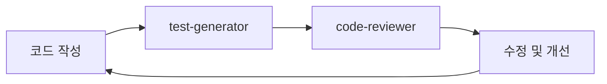
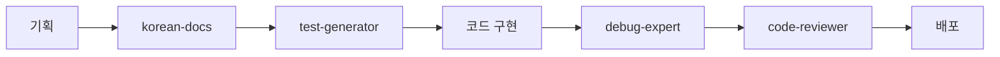
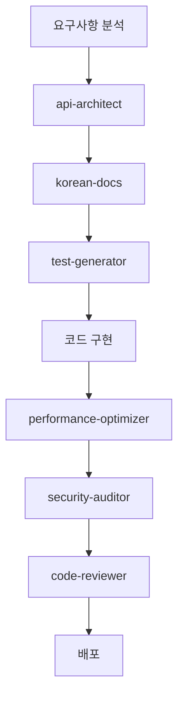

# 🤖 에이전트 상세 활용 가이드

> 팩별 에이전트의 특징과 효과적인 사용법

## 📋 목차

1. [팩별 에이전트 소개](#팩별-에이전트-소개)
2. [Starter Pack 에이전트](#starter-pack-에이전트)
3. [Essential Pack 에이전트](#essential-pack-에이전트)
4. [Professional Pack 에이전트](#professional-pack-에이전트)
5. [에이전트 조합 활용법](#에이전트-조합-활용법)
6. [실전 시나리오](#실전-시나리오)
7. [팁과 베스트 프랙티스](#팁과-베스트-프랙티스)

---

## 팩별 에이전트 소개

### 🎯 팩 시스템의 장점
- **점진적 학습**: 작은 것부터 시작해서 단계별로 확장
- **명확한 목적**: 각 팩은 특정 사용자 그룹에 최적화
- **선택의 용이함**: 복잡한 고민 없이 간단한 선택

### 📊 팩별 추천 사용자

| 팩 | 대상 | 상황 | 에이전트 수 |
|---|---|---|------------|
| 🚀 **Starter** | 처음 사용자 | Claude Code 에이전트 첫 경험 | **2개** |
| 🎨 **Essential** | 일반 사용자 | 개인 프로젝트 활발 개발 | **4개** |
| ⚡ **Professional** | 전문가 | 상용 서비스, 팀 프로젝트 | **7개** |

---

## 🚀 Starter Pack 에이전트

*"Claude Code 에이전트를 처음 사용해보고 싶어요"*

### 🔍 code-reviewer
**용도**: 포괄적인 코드 검토 및 품질 개선

**자동 선택 트리거**:
- "코드를 검토해주세요"
- "이 함수에 문제가 있나요?"
- "성능을 개선해주세요"
- "보안 문제를 확인해주세요"

**주요 기능**:
- 코드 품질 분석 (가독성, 유지보수성)
- 보안 취약점 탐지
- 성능 최적화 제안
- 베스트 프랙티스 적용 가이드
- TDD 관점에서의 테스트 가능성 검토

**활용 예시**:
```javascript
// 검토 요청 예시
function loginUser(username, password) {
    if (username && password) {
        return authenticateUser(username, password);
    }
    return false;
}

// 요청: "이 로그인 함수를 검토해주세요"
```

**출력 예시**:
```
## 🔍 코드 리뷰 결과

### ⚠️ 보안 이슈 (높음)
1. 패스워드 평문 처리 위험
2. 입력 검증 부족

### 💡 개선 제안
1. 패스워드 해싱 적용
2. 입력값 sanitization 추가
3. 에러 핸들링 강화

### ✅ 우수한 점
- 간결한 함수 구조
- 명확한 변수명 사용
```

### 🧪 test-generator
**용도**: TDD 기반 테스트 케이스 생성

**자동 선택 트리거**:
- "테스트를 작성해주세요"
- "TDD로 개발하고 싶어요"
- "테스트 케이스가 필요해요"
- "Red-Green-Refactor"

**주요 기능**:
- 실패하는 테스트 우선 작성 (Red)
- 엣지 케이스 및 경계값 테스트
- Mock 객체 활용 테스트
- 테스트 커버리지 개선
- 한국어 주석과 설명 포함

**활용 예시**:
```javascript
// 함수 정의
function calculateDiscount(price, discountRate) {
    // 구현 예정
}

// 요청: "이 할인 계산 함수의 TDD 테스트를 작성해주세요"
```

**출력 예시**:
```javascript
describe('calculateDiscount', () => {
    // 🔴 Red: 실패하는 테스트부터 작성
    it('정상적인 할인율로 올바른 할인가를 계산해야 함', () => {
        const result = calculateDiscount(1000, 0.1);
        expect(result).toBe(900);
    });

    // 경계값 테스트
    it('할인율이 0일 때 원가를 반환해야 함', () => {
        const result = calculateDiscount(1000, 0);
        expect(result).toBe(1000);
    });

    // 엣지 케이스
    it('잘못된 입력값에 대해 에러를 발생시켜야 함', () => {
        expect(() => calculateDiscount(-100, 0.1)).toThrow();
        expect(() => calculateDiscount(1000, 1.5)).toThrow();
    });
});
```

---

## 🎨 Essential Pack 에이전트

*"개인 개발 스타일에 맞춰서 사용하고 싶어요"*

**Starter Pack 포함 + 개인화 에이전트 2개 추가**

### 📚 korean-docs
**용도**: 체계적인 한국어 기술 문서 작성

**자동 선택 트리거**:
- "문서를 작성해주세요"
- "README를 만들어주세요"
- "API 가이드가 필요해요"
- "사용법을 설명해주세요"

**주요 기능**:
- 구조화된 마크다운 문서
- 목차와 단계별 가이드
- 실제 사용 예시 포함
- 적절한 이모지 활용
- 개발자 친화적 설명

**활용 예시**:
```javascript
class UserService {
    createUser(userData) { /* ... */ }
    updateUser(id, userData) { /* ... */ }
    deleteUser(id) { /* ... */ }
}

// 요청: "이 UserService 클래스의 API 문서를 작성해주세요"
```

**출력 예시**:
```markdown
# 📚 UserService API 가이드

## 📋 목차
1. [개요](#개요)
2. [메서드 설명](#메서드-설명)
3. [사용 예시](#사용-예시)

## 개요
사용자 관리를 위한 핵심 서비스 클래스입니다.

## 🔧 메서드 설명

### createUser(userData)
새로운 사용자를 생성합니다.

**파라미터**:
- `userData` (Object): 사용자 정보 객체

**반환값**:
- `Promise<User>`: 생성된 사용자 객체

**예시**:
```javascript
const newUser = await userService.createUser({
    email: 'user@example.com',
    name: '홍길동'
});
```
```

### 🐛 debug-expert
**용도**: 체계적인 디버깅 및 문제 해결

**자동 선택 트리거**:
- "에러가 발생했어요"
- "버그를 찾아주세요"
- "디버깅 도움이 필요해요"
- "왜 작동하지 않나요?"

**주요 기능**:
- 에러 메시지 분석
- 스택 트레이스 해석
- 근본 원인 분석
- 단계별 해결 방법 제시
- 재현 가능한 테스트 케이스 생성

**활용 예시**:
```
Error: Cannot read property 'name' of undefined
    at UserProfile.render (UserProfile.js:15)
    at ReactDOM.render (react-dom.js:1234)

// 요청: "이 에러의 원인을 분석하고 해결해주세요"
```

**출력 예시**:
```markdown
## 🐛 에러 분석 결과

### 📊 에러 요약
- **유형**: TypeError
- **위치**: UserProfile.js:15
- **원인**: undefined 객체의 프로퍼티 접근

### 🔍 근본 원인 분석
1. **직접적 원인**: user 객체가 undefined 상태
2. **가능한 시나리오**:
   - API 호출 전 렌더링 시도
   - 네트워크 에러로 데이터 로드 실패
   - 부모 컴포넌트에서 props 전달 누락

### 🛠️ 해결 방법
1. **즉시 해결**: 안전한 접근 패턴 적용
```javascript
// 기존 (에러 발생)
<div>{user.name}</div>

// 수정 (안전한 접근)
<div>{user?.name || '로딩 중...'}</div>
```

2. **근본 해결**: 데이터 로딩 상태 관리
3. **예방책**: PropTypes 또는 TypeScript 도입
```

---

## ⚡ Professional Pack 에이전트

*"모든 기능을 사용해서 전문적으로 개발하고 싶어요"*

**Essential Pack 포함 + 전문 에이전트 3개 추가**

### 🏗️ api-architect
**용도**: REST API 설계 및 구현

**자동 선택 트리거**:
- "API를 설계해주세요"
- "엔드포인트"
- "REST API"
- "OpenAPI"

**주요 기능**:
- RESTful API 설계 원칙 적용
- OpenAPI 스펙 작성
- 데이터 모델 정의
- 인증/권한 관리 설계
- API 문서 자동 생성

**활용 예시**:
```
// 요청: "사용자 관리를 위한 REST API를 설계해주세요"
```

**출력 예시**:
```yaml
# OpenAPI 3.0 스펙
openapi: 3.0.0
info:
  title: 사용자 관리 API
  version: 1.0.0

paths:
  /users:
    get:
      summary: 사용자 목록 조회
      parameters:
        - name: page
          in: query
          schema:
            type: integer
            default: 1
      responses:
        200:
          description: 성공
          content:
            application/json:
              schema:
                type: object
                properties:
                  users:
                    type: array
                    items:
                      $ref: '#/components/schemas/User'
    post:
      summary: 새 사용자 생성
      requestBody:
        required: true
        content:
          application/json:
            schema:
              $ref: '#/components/schemas/CreateUserRequest'

components:
  schemas:
    User:
      type: object
      properties:
        id:
          type: integer
        email:
          type: string
        name:
          type: string
```

### ⚡ performance-optimizer
**용도**: 성능 분석 및 최적화

**자동 선택 트리거**:
- "성능을 개선해주세요"
- "느려요"
- "최적화"
- "병목"

**주요 기능**:
- 성능 병목 지점 분석
- 메모리 사용량 최적화
- 데이터베이스 쿼리 개선
- 캐싱 전략 제안
- 성능 측정 테스트 작성

**활용 예시**:
```javascript
// 느린 코드
function getUsers() {
    const users = [];
    for (let i = 0; i < userIds.length; i++) {
        users.push(database.query(`SELECT * FROM users WHERE id = ${userIds[i]}`));
    }
    return users;
}

// 요청: "이 함수의 성능을 개선해주세요"
```

**출력 예시**:
```markdown
## ⚡ 성능 분석 결과

### 🔍 병목 지점
1. **N+1 쿼리 문제**: 사용자 수만큼 DB 쿼리 실행
2. **동기적 처리**: 순차 실행으로 인한 지연

### 💡 최적화 방안

#### 1. 배치 쿼리로 변경
```javascript
function getUsers() {
    // 하나의 쿼리로 모든 사용자 조회
    return database.query(`
        SELECT * FROM users
        WHERE id IN (${userIds.join(',')})
    `);
}
```

#### 2. 캐싱 적용
```javascript
const userCache = new Map();

function getUsers() {
    const cachedUsers = userIds
        .map(id => userCache.get(id))
        .filter(Boolean);

    const missingIds = userIds.filter(id => !userCache.has(id));

    if (missingIds.length === 0) {
        return cachedUsers;
    }

    // 캐시에 없는 사용자만 조회
    const newUsers = database.query(/*...*/);
    newUsers.forEach(user => userCache.set(user.id, user));

    return [...cachedUsers, ...newUsers];
}
```

### 📊 예상 성능 개선
- **쿼리 수**: 1000개 → 1개 (99.9% 감소)
- **응답 시간**: 5초 → 0.05초 (100배 개선)
```

### 🔒 security-auditor
**용도**: 보안 취약점 분석 및 강화

**자동 선택 트리거**:
- "보안을 확인해주세요"
- "취약점"
- "보안 검사"
- "OWASP"

**주요 기능**:
- OWASP Top 10 기반 검사
- 인증/권한 관리 검토
- 데이터 암호화 확인
- 보안 헤더 설정 검토
- 보안 테스트 케이스 작성

**활용 예시**:
```javascript
app.post('/login', (req, res) => {
    const { username, password } = req.body;

    const user = database.query(
        `SELECT * FROM users WHERE username = '${username}' AND password = '${password}'`
    );

    if (user) {
        res.cookie('user', JSON.stringify(user));
        res.json({ success: true });
    } else {
        res.json({ success: false });
    }
});

// 요청: "이 로그인 API의 보안을 검토해주세요"
```

**출력 예시**:
```markdown
## 🔒 보안 감사 결과

### ⚠️ 심각한 보안 취약점

#### 1. SQL 인젝션 (OWASP A03)
**위험도**: 🔴 **매우 높음**
**문제**: 사용자 입력을 직접 쿼리에 삽입
```javascript
// 취약한 코드
const query = `SELECT * FROM users WHERE username = '${username}'`;

// 공격 예시
username = "admin'; DROP TABLE users; --"
```

#### 2. 평문 패스워드 저장 (OWASP A02)
**위험도**: 🔴 **매우 높음**
**문제**: 패스워드를 해싱 없이 평문으로 비교

#### 3. 안전하지 않은 쿠키 (OWASP A05)
**위험도**: 🟡 **중간**
**문제**: 민감한 정보를 평문 쿠키로 저장

### 🛠️ 보안 강화 방안

#### 1. SQL 인젝션 방지
```javascript
// 안전한 코드: 파라미터화된 쿼리
const user = await database.query(
    'SELECT * FROM users WHERE username = ? AND password_hash = ?',
    [username, hashedPassword]
);
```

#### 2. 패스워드 해싱
```javascript
const bcrypt = require('bcrypt');

// 회원가입 시
const hashedPassword = await bcrypt.hash(password, 10);

// 로그인 시
const isValid = await bcrypt.compare(password, user.password_hash);
```

#### 3. 안전한 세션 관리
```javascript
// JWT 토큰 사용
const jwt = require('jsonwebtoken');

const token = jwt.sign({ userId: user.id }, process.env.JWT_SECRET, {
    expiresIn: '1h'
});

res.cookie('token', token, {
    httpOnly: true,  // XSS 방지
    secure: true,    // HTTPS 전용
    sameSite: 'strict'  // CSRF 방지
});
```

### ✅ 보안 테스트 케이스
```javascript
describe('보안 테스트', () => {
    it('SQL 인젝션을 차단해야 함', async () => {
        const maliciousInput = "admin'; DROP TABLE users; --";
        const response = await request(app)
            .post('/login')
            .send({ username: maliciousInput, password: 'test' });

        expect(response.status).toBe(400);
        // 데이터베이스가 여전히 존재하는지 확인
        const users = await database.query('SELECT COUNT(*) FROM users');
        expect(users).toBeDefined();
    });
});
```
```

---

## 🔄 에이전트 조합 활용법

### 팩별 워크플로우

#### 🚀 Starter Pack 워크플로우


**사용 시나리오**:
1. 새 기능 구현
2. 테스트 케이스 생성
3. 코드 리뷰 및 개선
4. 반복 개선

#### 🎨 Essential Pack 워크플로우


**사용 시나리오**:
1. 프로젝트 문서화
2. TDD 개발
3. 디버깅 및 문제 해결
4. 최종 코드 리뷰

#### ⚡ Professional Pack 워크플로우


**사용 시나리오**:
1. API 설계 및 문서화
2. TDD 개발
3. 성능 최적화
4. 보안 강화
5. 종합 코드 리뷰

---

## 🎯 실전 시나리오

### 시나리오 1: 새로운 기능 개발 (Starter Pack)

```text
🎯 목표: 사용자 로그인 기능 구현

1. "사용자 로그인 기능의 테스트를 먼저 작성해주세요"
   → test-generator가 TDD 테스트 케이스 생성

2. 테스트에 맞춰 로그인 기능 구현

3. "구현한 로그인 함수를 검토해주세요"
   → code-reviewer가 보안, 품질, 성능 검토

4. 피드백 반영하여 코드 개선
```

### 시나리오 2: 개인 프로젝트 개발 (Essential Pack)

```text
🎯 목표: 개인 블로그 프로젝트 개발

1. "블로그 프로젝트의 README를 작성해주세요"
   → korean-docs가 체계적인 프로젝트 문서 생성

2. "댓글 기능의 테스트를 작성해주세요"
   → test-generator가 TDD 테스트 생성

3. 댓글 기능 구현 중 에러 발생

4. "댓글 저장 시 이 에러가 발생합니다: [에러 메시지]"
   → debug-expert가 근본 원인 분석 및 해결책 제시

5. "최종 댓글 기능을 검토해주세요"
   → code-reviewer가 전체적인 품질 검토
```

### 시나리오 3: 상용 서비스 개발 (Professional Pack)

```text
🎯 목표: 전자상거래 API 서비스 개발

1. "주문 관리 API를 설계해주세요"
   → api-architect가 RESTful API 설계 및 OpenAPI 스펙 생성

2. "API 문서를 한국어로 작성해주세요"
   → korean-docs가 개발자 친화적 API 가이드 생성

3. "주문 생성 API의 테스트를 작성해주세요"
   → test-generator가 엣지 케이스 포함 테스트 생성

4. API 구현 후 성능 이슈 발생

5. "주문 조회 API가 너무 느려요"
   → performance-optimizer가 병목 분석 및 최적화 방안 제시

6. "결제 관련 API의 보안을 검토해주세요"
   → security-auditor가 OWASP 기반 보안 감사

7. "전체 주문 API를 최종 검토해주세요"
   → code-reviewer가 종합적인 품질 검토
```

---

## 💡 팁과 베스트 프랙티스

### 효과적인 에이전트 활용법

#### 1. 구체적인 요청하기
```text
❌ "코드를 확인해주세요"
✅ "이 사용자 인증 함수의 보안과 성능을 검토해주세요"

❌ "테스트를 작성해주세요"
✅ "결제 처리 함수의 TDD 테스트를 작성해주세요. 실패 케이스와 엣지 케이스를 포함해서요"
```

#### 2. 컨텍스트 제공하기
```text
❌ "에러가 발생했어요"
✅ "Node.js 환경에서 PostgreSQL 연결 시 다음 에러가 발생합니다: [에러 메시지]"

❌ "문서를 작성해주세요"
✅ "React 컴포넌트 라이브러리의 사용 가이드를 한국어로 작성해주세요. 설치부터 예시까지 포함해서요"
```

#### 3. 단계별 진행하기

**Starter Pack 워크플로우**:
```text
1단계: 테스트 작성 (test-generator)
2단계: 코드 구현
3단계: 리뷰 (code-reviewer)
4단계: 개선 및 완료
```

**Essential Pack 워크플로우**:
```text
1단계: 문서화 (korean-docs)
2단계: TDD 개발 (test-generator)
3단계: 디버깅 (debug-expert)
4단계: 최종 리뷰 (code-reviewer)
```

**Professional Pack 워크플로우**:
```text
1단계: API 설계 (api-architect)
2단계: 문서화 (korean-docs)
3단계: TDD 개발 (test-generator)
4단계: 성능 최적화 (performance-optimizer)
5단계: 보안 강화 (security-auditor)
6단계: 최종 리뷰 (code-reviewer)
```

### 팩 업그레이드 시점

#### 🚀 → 🎨 Essential Pack으로 업그레이드
- ✅ Starter Pack에 익숙해짐
- ✅ 한국어 문서화가 중요해짐
- ✅ 체계적인 디버깅이 필요함
- ✅ 더 많은 기능을 원함

#### 🎨 → ⚡ Professional Pack으로 업그레이드
- ✅ API 개발을 자주 함
- ✅ 성능 최적화가 중요함
- ✅ 보안이 중요한 프로젝트
- ✅ 상용 서비스 개발

### 에이전트 선택 최적화

#### 자동 선택을 위한 팁
- **PROACTIVELY** 키워드가 포함된 설명이 자동 선택 확률을 높임
- 작업의 성격을 명확히 표현하면 적절한 에이전트가 선택됨
- 필요시 에이전트 이름을 직접 지정하여 명시적 호출 가능

#### 효율적인 작업 순서
1. **문서화 먼저**: 큰 그림을 그리고 시작
2. **테스트 주도**: TDD로 안정적인 개발
3. **점진적 개선**: 작동 → 최적화 → 보안 순서
4. **최종 검증**: 모든 것이 완료된 후 종합 리뷰

---

## 🎉 결론

### 팩별 핵심 가치

#### 🚀 Starter Pack
- **목표**: Claude Code 에이전트 경험하기
- **핵심**: 코드 리뷰 + TDD 개발
- **효과**: 기본적인 개발 품질 향상

#### 🎨 Essential Pack
- **목표**: 개인 스타일에 맞춘 개발
- **핵심**: 한국어 문서 + 체계적 디버깅
- **효과**: 개인 프로젝트의 완성도 극대화

#### ⚡ Professional Pack
- **목표**: 전문가 수준의 개발
- **핵심**: API 설계 + 성능/보안 최적화
- **효과**: 상용 서비스 수준의 품질 달성

### 🚀 시작하는 법

1. **Starter Pack**부터 시작하세요
2. 익숙해지면 **Essential Pack**으로 확장
3. 필요시 **Professional Pack**으로 완성

**작은 것부터 시작해서 점진적으로 확장하는 것이 가장 효과적입니다!**

---

*에이전트 활용에 대한 질문이나 개선 제안이 있다면 언제든 GitHub Issues를 통해 공유해주세요! 🙋‍♂️*