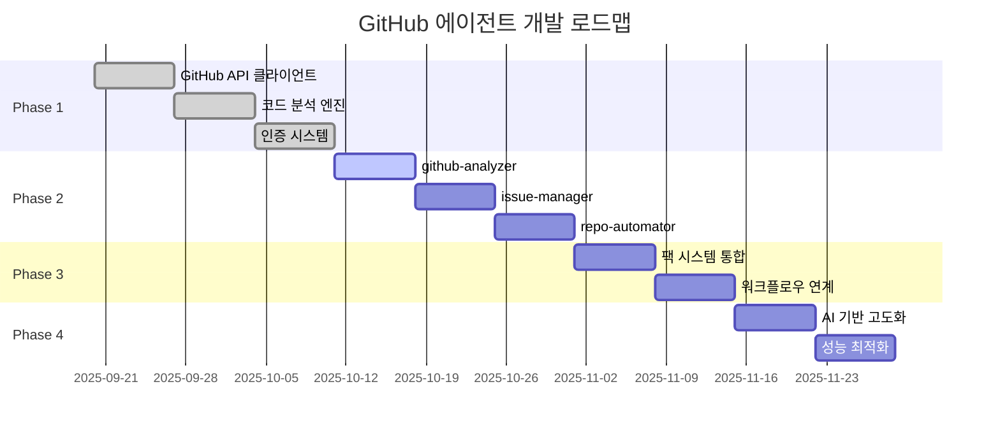
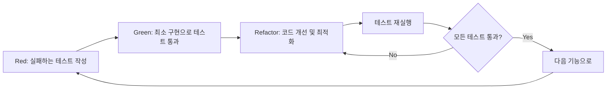
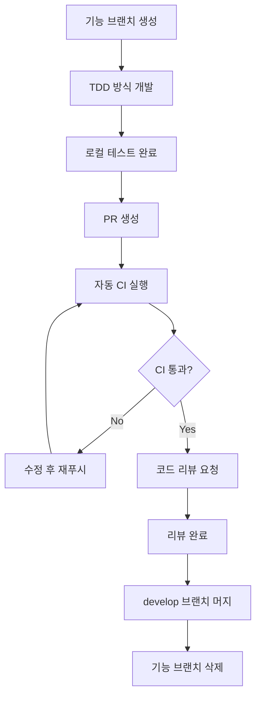

# 🗺️ GitHub 프로젝트 분석 에이전트 구현 로드맵

> **작성일**: 2025-09-20
> **목적**: TDD 기반의 단계별 구현 계획과 검증 전략

---

## 📋 목차

1. [개발 철학](#개발-철학)
2. [전체 로드맵 개요](#전체-로드맵-개요)
3. [Phase 1: 기반 구조 구축](#phase-1-기반-구조-구축)
4. [Phase 2: 핵심 에이전트 개발](#phase-2-핵심-에이전트-개발)
5. [Phase 3: 시스템 통합](#phase-3-시스템-통합)
6. [Phase 4: 고도화 및 최적화](#phase-4-고도화-및-최적화)
7. [TDD 프로세스](#tdd-프로세스)
8. [브랜치 전략](#브랜치-전략)
9. [검증 기준](#검증-기준)
10. [위험 관리](#위험-관리)

---

## 개발 철학

### 🎯 핵심 원칙
- **🧪 TDD First**: 모든 기능은 테스트부터 작성
- **📝 단계별 검증**: 각 단계 완료 후 철저한 검증
- **🔄 점진적 통합**: 기존 시스템과의 원활한 통합
- **🇰🇷 한국어 중심**: 모든 문서와 주석은 한국어로

### 🛡️ 품질 기준
```yaml
# 각 단계별 통과 기준
quality_gates:
  unit_tests: 90% 이상 커버리지
  integration_tests: 모든 핵심 시나리오 통과
  performance_tests: 기존 대비 성능 저하 없음
  security_tests: 보안 취약점 0개
  documentation: 모든 API 및 기능 문서화 완료
```

---

## 전체 로드맵 개요

### 📅 타임라인 (총 8-10주)



### 🏆 마일스톤
1. **M1**: GitHub API 연동 완료 (3주차)
2. **M2**: 핵심 에이전트 3개 완성 (6주차)
3. **M3**: 기존 시스템 통합 완료 (8주차)
4. **M4**: 프로덕션 준비 완료 (10주차)

---

## Phase 1: 기반 구조 구축 (3주)

### 🎯 목표
GitHub API 연동과 코드 분석을 위한 핵심 인프라 구축

### 📋 세부 작업

#### Week 1: GitHub API 클라이언트 개발
```bash
# 브랜치 생성
git checkout -b feature/github-api-client

# TDD 사이클 시작
```

**구현할 기능:**
1. **GraphQL 클라이언트**
   ```javascript
   // github-api-client.test.js (Red)
   describe('GitHubAPIClient', () => {
     test('should fetch repository information', async () => {
       const client = new GitHubAPIClient(mockToken);
       const repo = await client.getRepository('owner', 'repo');
       expect(repo.name).toBe('repo');
       expect(repo.primaryLanguage).toBeDefined();
     });
   });

   // github-api-client.js (Green)
   class GitHubAPIClient {
     async getRepository(owner, name) {
       // 최소 구현
     }
   }

   // Refactor: 성능 최적화, 에러 핸들링 개선
   ```

2. **Rate Limiting 처리**
   ```javascript
   // rate-limiter.test.js
   test('should respect GitHub API rate limits', async () => {
     const limiter = new RateLimiter();
     const start = Date.now();

     await Promise.all([
       limiter.acquire(),
       limiter.acquire(),
       limiter.acquire()
     ]);

     expect(Date.now() - start).toBeGreaterThan(100);
   });
   ```

3. **응답 캐싱 시스템**
   ```javascript
   // cache-manager.test.js
   test('should cache API responses', async () => {
     const cache = new CacheManager();
     const data = { test: 'data' };

     await cache.set('key', data);
     const cached = await cache.get('key');

     expect(cached).toEqual(data);
   });
   ```

**완료 기준:**
- ✅ 모든 단위 테스트 통과 (커버리지 90% 이상)
- ✅ GitHub API 실제 연동 테스트 성공
- ✅ Rate limiting 정상 작동 확인
- ✅ 캐싱 시스템 성능 검증

#### Week 2: 코드 분석 엔진 개발
```bash
git checkout -b feature/code-analysis-engine
```

**구현할 기능:**
1. **AST 파서 통합**
   ```javascript
   // ast-parser.test.js
   describe('ASTParser', () => {
     test('should parse JavaScript file correctly', () => {
       const parser = new ASTParser('javascript');
       const ast = parser.parse('function test() { return 42; }');

       expect(ast.type).toBe('Program');
       expect(ast.body[0].type).toBe('FunctionDeclaration');
     });
   });
   ```

2. **복잡도 계산기**
   ```javascript
   // complexity-calculator.test.js
   test('should calculate cyclomatic complexity', () => {
     const calculator = new ComplexityCalculator();
     const code = `
       function complexFunction(x) {
         if (x > 0) {
           for (let i = 0; i < x; i++) {
             if (i % 2 === 0) {
               console.log(i);
             }
           }
         }
         return x;
       }
     `;

     const complexity = calculator.calculate(code);
     expect(complexity.cyclomatic).toBe(4);
   });
   ```

3. **정적 분석 도구 연동**
   ```javascript
   // static-analyzer.test.js
   test('should detect code smells', async () => {
     const analyzer = new StaticAnalyzer();
     const issues = await analyzer.analyze(sampleCode);

     expect(issues).toContain(
       expect.objectContaining({
         type: 'code_smell',
         severity: 'minor'
       })
     );
   });
   ```

**완료 기준:**
- ✅ 주요 언어 (JS, TS, Python, Java) 파싱 지원
- ✅ 복잡도 메트릭 정확성 검증
- ✅ 정적 분석 도구 통합 완료
- ✅ 성능 벤치마크 통과 (1000 라인/초 이상)

#### Week 3: 인증 및 권한 관리 시스템
```bash
git checkout -b feature/auth-system
```

**구현할 기능:**
1. **토큰 검증 시스템**
   ```javascript
   // auth-manager.test.js
   test('should validate GitHub token', async () => {
     const auth = new AuthManager();
     const result = await auth.validateToken(validToken);

     expect(result.valid).toBe(true);
     expect(result.scopes).toContain('repo');
   });
   ```

2. **권한 체크 미들웨어**
   ```javascript
   test('should check required permissions', () => {
     const auth = new AuthManager();
     const hasPermission = auth.checkPermissions(
       'github-analyzer',
       ['repo:read', 'metadata:read']
     );

     expect(hasPermission).toBe(true);
   });
   ```

**완료 기준:**
- ✅ Fine-Grained PAT 지원
- ✅ 권한 검증 로직 완성
- ✅ 보안 테스트 통과
- ✅ 에러 핸들링 체계 구축

---

## Phase 2: 핵심 에이전트 개발 (3주)

### 🎯 목표
GitHub Pack의 3개 핵심 에이전트 완성

### 📋 에이전트별 개발 계획

#### Week 4: github-analyzer 에이전트
```bash
git checkout -b feature/github-analyzer
```

**TDD 사이클:**
```javascript
// github-analyzer.test.js (Red Phase)
describe('GitHubAnalyzer', () => {
  test('should analyze repository structure', async () => {
    const analyzer = new GitHubAnalyzer();
    const analysis = await analyzer.analyzeRepository('owner/repo');

    expect(analysis).toHaveProperty('structure');
    expect(analysis).toHaveProperty('languages');
    expect(analysis).toHaveProperty('metrics');
    expect(analysis).toHaveProperty('quality');
  });

  test('should detect project type correctly', async () => {
    const analyzer = new GitHubAnalyzer();
    const projectType = await analyzer.detectProjectType(mockRepo);

    expect(projectType).toBe('react-typescript');
  });

  test('should generate quality report in Korean', async () => {
    const analyzer = new GitHubAnalyzer();
    const report = await analyzer.generateReport(mockAnalysis);

    expect(report.language).toBe('ko');
    expect(report.sections).toContain('코드 품질 분석');
  });
});
```

**구현 단계:**
1. **Green Phase**: 최소 기능 구현
   ```javascript
   class GitHubAnalyzer {
     async analyzeRepository(repoUrl) {
       // 기본 분석 로직
       return {
         structure: await this.analyzeStructure(repoUrl),
         languages: await this.detectLanguages(repoUrl),
         metrics: await this.calculateMetrics(repoUrl),
         quality: await this.assessQuality(repoUrl)
       };
     }
   }
   ```

2. **Refactor Phase**: 성능 최적화 및 확장
   ```javascript
   class GitHubAnalyzer {
     constructor() {
       this.apiClient = new GitHubAPIClient();
       this.codeAnalyzer = new CodeAnalyzer();
       this.cache = new CacheManager();
     }

     async analyzeRepository(repoUrl) {
       const cacheKey = `analysis:${repoUrl}`;
       const cached = await this.cache.get(cacheKey);

       if (cached) return cached;

       const [structure, languages, metrics, quality] = await Promise.all([
         this.analyzeStructure(repoUrl),
         this.detectLanguages(repoUrl),
         this.calculateMetrics(repoUrl),
         this.assessQuality(repoUrl)
       ]);

       const result = { structure, languages, metrics, quality };
       await this.cache.set(cacheKey, result, 'analysis_result');

       return result;
     }
   }
   ```

**완료 기준:**
- ✅ 리포지토리 구조 분석 정확도 95%
- ✅ 언어 감지 정확도 98%
- ✅ 품질 메트릭 계산 검증
- ✅ 한국어 리포트 생성 완료

#### Week 5: issue-manager 에이전트
```bash
git checkout -b feature/issue-manager
```

**TDD 사이클:**
```javascript
// issue-manager.test.js
describe('IssueManager', () => {
  test('should categorize issues automatically', async () => {
    const manager = new IssueManager();
    const category = await manager.categorizeIssue(mockIssue);

    expect(category).toMatchObject({
      type: 'bug',
      priority: 'medium',
      labels: ['버그', '수정 필요']
    });
  });

  test('should auto-assign reviewers for PR', async () => {
    const manager = new IssueManager();
    const assignees = await manager.assignReviewers(mockPR);

    expect(assignees).toHaveLength(2);
    expect(assignees[0]).toHaveProperty('expertise');
  });
});
```

**핵심 기능:**
1. **이슈 자동 분류**
2. **PR 코드 리뷰 자동화**
3. **라벨링 시스템**
4. **담당자 배정 로직**

#### Week 6: repo-automator 에이전트
```bash
git checkout -b feature/repo-automator
```

**TDD 사이클:**
```javascript
// repo-automator.test.js
describe('RepoAutomator', () => {
  test('should generate CI/CD workflow', async () => {
    const automator = new RepoAutomator();
    const workflow = await automator.generateCICD(mockRepo);

    expect(workflow).toContain('name: CI/CD Pipeline');
    expect(workflow).toContain('runs-on: ubuntu-latest');
  });

  test('should create test automation', async () => {
    const automator = new RepoAutomator();
    const testConfig = await automator.setupTestAutomation(mockRepo);

    expect(testConfig.framework).toBeDefined();
    expect(testConfig.scripts).toHaveProperty('test');
  });
});
```

**핵심 기능:**
1. **GitHub Actions 워크플로우 생성**
2. **테스트 자동화 설정**
3. **배포 파이프라인 구성**
4. **코드 품질 검사 자동화**

---

## Phase 3: 시스템 통합 (2주)

### 🎯 목표
기존 claude-code 에이전트 시스템과의 완벽한 통합

#### Week 7: 팩 시스템 통합
```bash
git checkout -b feature/pack-integration
```

**작업 내용:**
1. **에이전트 설정 파일 생성**
   ```json
   // agents/github/github-analyzer.json
   {
     "name": "github-analyzer",
     "description": "GitHub 리포지토리를 PROACTIVELY 분석하여...",
     "tools": ["Read", "Grep", "Glob", "WebFetch", "Bash"],
     "model": "sonnet",
     "github_permissions": ["repo:read", "metadata:read"]
   }
   ```

2. **자동 선택 로직 업데이트**
   ```javascript
   // agent-selector.js
   const GITHUB_KEYWORDS = [
     '리포지토리', 'repository', 'GitHub', '깃헙',
     '이슈', 'issue', 'PR', '풀 리퀘스트',
     'CI/CD', '자동화', 'workflow'
   ];

   function selectAgent(userInput) {
     if (containsGitHubKeywords(userInput)) {
       return selectGitHubAgent(userInput);
     }
     return selectDefaultAgent(userInput);
   }
   ```

3. **설치 스크립트 업데이트**
   ```bash
   # scripts/setup.sh 수정
   echo "🐙 GitHub Pack 설치 옵션 추가"
   echo "1. Starter Pack (2개)"
   echo "2. Essential Pack (4개)"
   echo "3. Professional Pack (7개)"
   echo "4. GitHub Pack (10개) - NEW!"
   ```

#### Week 8: 워크플로우 연계
```bash
git checkout -b feature/workflow-integration
```

**워크플로우 정의:**
```javascript
// workflows/github-analysis.js
const GITHUB_ANALYSIS_WORKFLOW = {
  name: 'github-comprehensive-analysis',
  steps: [
    { agent: 'github-analyzer', action: 'analyze-repository' },
    { agent: 'code-reviewer', action: 'review-codebase' },
    { agent: 'security-auditor', action: 'security-scan' },
    { agent: 'korean-docs', action: 'generate-report' }
  ],
  parallel: ['code-reviewer', 'security-auditor'],
  condition: 'github_repository_provided'
};
```

**통합 테스트:**
```javascript
// integration.test.js
test('should execute GitHub analysis workflow', async () => {
  const orchestrator = new AgentOrchestrator();
  const result = await orchestrator.executeWorkflow(
    'github-comprehensive-analysis',
    { repository: 'owner/repo' }
  );

  expect(result.status).toBe('completed');
  expect(result.reports).toHaveLength(4);
});
```

---

## Phase 4: 고도화 및 최적화 (2주)

### 🎯 목표
AI 기반 고도화와 성능 최적화

#### Week 9: AI 기반 고도화
```bash
git checkout -b feature/ai-enhancement
```

**구현할 기능:**
1. **지능형 코드 패턴 분석**
   ```javascript
   // ai-pattern-analyzer.test.js
   test('should detect anti-patterns using AI', async () => {
     const analyzer = new AIPatternAnalyzer();
     const patterns = await analyzer.detectPatterns(codebase);

     expect(patterns.antiPatterns).toContain('singleton-overuse');
     expect(patterns.recommendations).toBeDefined();
   });
   ```

2. **자동 이슈 우선순위 예측**
   ```javascript
   test('should predict issue priority', async () => {
     const predictor = new IssuePriorityPredictor();
     const priority = await predictor.predict(issueData);

     expect(priority.level).toBeOneOf(['low', 'medium', 'high', 'critical']);
     expect(priority.confidence).toBeGreaterThan(0.8);
   });
   ```

#### Week 10: 성능 최적화
```bash
git checkout -b feature/performance-optimization
```

**최적화 목표:**
- 분석 속도 50% 향상
- 메모리 사용량 30% 감소
- API 요청 수 40% 감소

**구현 내용:**
1. **병렬 처리 최적화**
2. **캐싱 전략 개선**
3. **API 요청 배치 처리**
4. **메모리 풀링**

---

## TDD 프로세스

### 🔄 Red-Green-Refactor 사이클



### 📝 테스트 작성 가이드

#### 1. 단위 테스트 (Unit Tests)
```javascript
// 좋은 테스트 예시
describe('GitHubAPIClient', () => {
  describe('getRepository', () => {
    it('유효한 리포지토리 정보를 반환해야 함', async () => {
      // Given: 준비
      const client = new GitHubAPIClient(mockToken);
      const mockResponse = { name: 'test-repo', stars: 100 };
      fetchMock.mockResolvedValue(mockResponse);

      // When: 실행
      const result = await client.getRepository('owner', 'repo');

      // Then: 검증
      expect(result.name).toBe('test-repo');
      expect(result.stars).toBe(100);
      expect(fetchMock).toHaveBeenCalledWith(
        expect.stringContaining('owner/repo')
      );
    });

    it('잘못된 토큰일 때 에러를 발생시켜야 함', async () => {
      // Given
      const client = new GitHubAPIClient('invalid-token');
      fetchMock.mockRejectedValue(new Error('Unauthorized'));

      // When & Then
      await expect(
        client.getRepository('owner', 'repo')
      ).rejects.toThrow('Unauthorized');
    });
  });
});
```

#### 2. 통합 테스트 (Integration Tests)
```javascript
describe('GitHub Agent Integration', () => {
  it('실제 GitHub API와 연동하여 분석을 수행해야 함', async () => {
    // Given: 실제 공개 리포지토리 사용
    const analyzer = new GitHubAnalyzer();
    const testRepo = 'microsoft/vscode';

    // When: 실제 분석 수행
    const analysis = await analyzer.analyzeRepository(testRepo);

    // Then: 결과 검증
    expect(analysis.languages).toContain('TypeScript');
    expect(analysis.metrics.stars).toBeGreaterThan(100000);
    expect(analysis.quality.score).toBeGreaterThan(0);
  });
});
```

#### 3. E2E 테스트 (End-to-End Tests)
```javascript
describe('GitHub Pack E2E', () => {
  it('사용자 요청부터 결과 리포트까지 전체 워크플로우가 작동해야 함', async () => {
    // Given: 사용자 입력 시뮬레이션
    const userInput = 'microsoft/vscode 리포지토리를 분석해주세요';

    // When: 전체 프로세스 실행
    const result = await claudeCode.processRequest(userInput);

    // Then: 최종 결과 검증
    expect(result.agent).toBe('github-analyzer');
    expect(result.report).toContain('분석 완료');
    expect(result.recommendations).toBeDefined();
  });
});
```

### 🎯 테스트 커버리지 목표
- **단위 테스트**: 90% 이상
- **통합 테스트**: 주요 시나리오 100%
- **E2E 테스트**: 핵심 워크플로우 100%

---

## 브랜치 전략

### 🌳 Git Flow 기반 브랜치 모델

```
main (프로덕션)
├── develop (개발 통합)
│   ├── feature/github-api-client
│   ├── feature/code-analysis-engine
│   ├── feature/auth-system
│   ├── feature/github-analyzer
│   ├── feature/issue-manager
│   ├── feature/repo-automator
│   ├── feature/pack-integration
│   └── feature/workflow-integration
└── release/github-pack-v1.0
```

### 📝 커밋 메시지 규칙 (깃모지 활용)

```bash
# 기능 추가
🚀 feat: GitHub API 클라이언트 기본 기능 구현

# 버그 수정
🐛 fix: Rate limiting 로직 오류 수정

# 테스트 추가
✅ test: GitHub analyzer 단위 테스트 추가

# 문서 업데이트
📝 docs: API 사용 가이드 작성

# 성능 개선
⚡ perf: 병렬 처리로 분석 속도 50% 향상

# 리팩토링
♻️ refactor: 코드 분석 엔진 구조 개선

# 설정 변경
🔧 chore: ESLint 설정 업데이트
```

### 🔄 PR 프로세스



### 📋 PR 템플릿

```markdown
## 🎯 변경 사항
- [ ] 새로운 기능 추가
- [ ] 버그 수정
- [ ] 성능 개선
- [ ] 문서 업데이트

## 📝 상세 설명
구현한 기능에 대한 상세 설명을 작성합니다.

## 🧪 테스트
- [ ] 단위 테스트 추가/수정
- [ ] 통합 테스트 통과
- [ ] E2E 테스트 확인

## 📸 스크린샷 (선택사항)
결과 화면이나 로그 등을 첨부합니다.

## 🔗 관련 이슈
Closes #123

## ✅ 체크리스트
- [ ] 모든 테스트 통과
- [ ] 코드 리뷰 완료
- [ ] 문서 업데이트
- [ ] 성능 영향 검토
```

---

## 검증 기준

### 🎯 각 Phase별 완료 기준

#### Phase 1 검증
```yaml
github_api_client:
  - API 연결 성공률: 99.9%
  - Rate limiting 준수: 100%
  - 응답 시간: 평균 500ms 이하
  - 에러 핸들링: 모든 HTTP 상태 코드 처리

code_analysis_engine:
  - 언어 지원: JS, TS, Python, Java
  - 분석 정확도: 95% 이상
  - 처리 속도: 1000 LoC/초 이상
  - 메모리 사용량: 100MB 이하

auth_system:
  - 토큰 검증: 100% 정확
  - 권한 체크: 모든 에이전트 지원
  - 보안 테스트: 취약점 0개
```

#### Phase 2 검증
```yaml
github_analyzer:
  - 리포지토리 분석: 95% 정확도
  - 언어 감지: 98% 정확도
  - 보고서 생성: 한국어 완벽 지원
  - 성능: 중형 리포지토리 5분 이내

issue_manager:
  - 이슈 분류: 90% 정확도
  - PR 리뷰: 기본 체크리스트 100%
  - 라벨링: 자동 적용 95%
  - 워크플로우: 모든 시나리오 테스트

repo_automator:
  - 워크플로우 생성: 주요 프레임워크 지원
  - CI/CD 설정: 90% 성공률
  - 테스트 자동화: 기본 설정 완료
  - 배포 파이프라인: 스테이징/프로덕션 구분
```

### 🔍 통합 테스트 시나리오

```javascript
// 핵심 시나리오 테스트
const INTEGRATION_SCENARIOS = [
  {
    name: 'React 프로젝트 전체 분석',
    repository: 'facebook/react',
    expected: {
      projectType: 'react-library',
      languages: ['JavaScript', 'TypeScript'],
      qualityScore: '>= 80',
      workflow: 'generated'
    }
  },
  {
    name: 'Python Django 프로젝트 분석',
    repository: 'django/django',
    expected: {
      projectType: 'django-framework',
      languages: ['Python'],
      qualityScore: '>= 85',
      workflow: 'generated'
    }
  },
  {
    name: '개인 프로젝트 이슈 관리',
    repository: 'personal/small-project',
    expected: {
      issueCategories: 'defined',
      prTemplates: 'created',
      automation: 'basic'
    }
  }
];
```

### 📊 성능 벤치마크

```yaml
performance_targets:
  small_repository: # <100 파일
    analysis_time: '<2분'
    memory_usage: '<50MB'
    api_calls: '<20'

  medium_repository: # 100-1000 파일
    analysis_time: '<5분'
    memory_usage: '<100MB'
    api_calls: '<50'

  large_repository: # 1000+ 파일
    analysis_time: '<15분'
    memory_usage: '<200MB'
    api_calls: '<100'
```

---

## 위험 관리

### ⚠️ 주요 위험 요소

#### 1. GitHub API 제한
**위험**: Rate limiting으로 인한 서비스 중단
```yaml
위험도: High
완화방안:
  - 지능형 요청 스케줄링
  - 다중 토큰 순환 사용
  - 캐싱 계층 강화
  - 백오프 전략 구현
```

#### 2. 대용량 리포지토리 처리
**위험**: 메모리 부족 및 타임아웃
```yaml
위험도: Medium
완화방안:
  - 스트리밍 처리 방식 도입
  - 청크 단위 분석
  - 점진적 결과 반환
  - 메모리 모니터링
```

#### 3. 보안 취약점
**위험**: 토큰 노출 및 권한 오남용
```yaml
위험도: High
완화방안:
  - 토큰 암호화 저장
  - 최소 권한 원칙 적용
  - 정기 보안 감사
  - 접근 로그 모니터링
```

### 🛡️ 비상 계획

#### API 장애 시 대응
```javascript
// fallback-strategy.js
class FallbackStrategy {
  async handleAPIFailure(error) {
    switch (error.type) {
      case 'RATE_LIMIT':
        return await this.activateCache();
      case 'NETWORK_ERROR':
        return await this.retryWithBackoff();
      case 'AUTH_ERROR':
        return await this.refreshToken();
      default:
        return await this.gracefulDegradation();
    }
  }
}
```

#### 품질 게이트 실패 시
```bash
# quality-gate-failure.sh
#!/bin/bash

if [ "$TEST_COVERAGE" -lt 90 ]; then
  echo "❌ 테스트 커버리지 부족: $TEST_COVERAGE%"
  echo "🔧 필요 작업: 테스트 케이스 추가"
  exit 1
fi

if [ "$PERFORMANCE_SCORE" -lt 80 ]; then
  echo "❌ 성능 기준 미달: $PERFORMANCE_SCORE점"
  echo "🔧 필요 작업: 성능 최적화"
  exit 1
fi
```

---

## 마무리

### 🎉 성공 기준
- ✅ 모든 Phase별 검증 기준 통과
- ✅ 기존 claude-code 시스템과 완벽 통합
- ✅ 사용자 피드백 긍정적 (4.5/5.0 이상)
- ✅ 성능 목표 달성 (분석 시간 50% 단축)

### 🔄 지속적 개선
```yaml
post_launch:
  monitoring:
    - 사용량 추적
    - 성능 메트릭 모니터링
    - 에러율 추적
    - 사용자 피드백 수집

  updates:
    - 월간 기능 업데이트
    - 분기별 성능 최적화
    - 연간 메이저 버전 업그레이드
```

이 로드맵을 따라 체계적이고 안정적인 GitHub 프로젝트 분석 에이전트를 구축할 수 있습니다. TDD 방식의 철저한 검증과 단계별 통합을 통해 높은 품질의 솔루션을 제공할 것입니다.