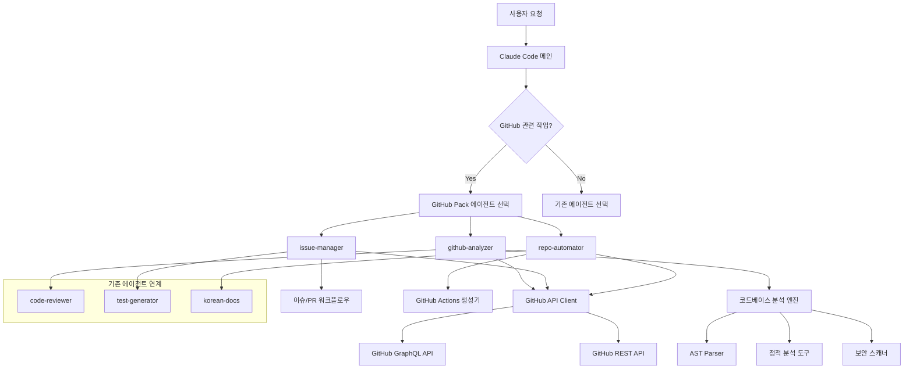

# 🐙 GitHub 프로젝트 분석 에이전트 개발 가이드

> **작성일**: 2025-09-20
> **목적**: GitHub 리포지토리를 자동으로 분석하고 작업을 수행할 수 있는 에이전트 개발을 위한 종합 가이드

---

## 📋 목차

1. [개요](#개요)
2. [현재 시스템 분석](#현재-시스템-분석)
3. [GitHub API 활용 전략](#github-api-활용-전략)
4. [아키텍처 설계](#아키텍처-설계)
5. [코드베이스 분석 엔진](#코드베이스-분석-엔진)
6. [에이전트 통합 전략](#에이전트-통합-전략)
7. [보안 및 권한 관리](#보안-및-권한-관리)
8. [성능 최적화](#성능-최적화)

---

## 개요

### 🎯 목적
Claude Code 에이전트 시스템을 확장하여 GitHub 프로젝트를 자동으로 분석하고, 이슈 관리, PR 리뷰, 자동화 워크플로우 구성 등의 작업을 수행할 수 있는 고도화된 에이전트 시스템 개발

### 🌟 핵심 가치
- **🧪 TDD 중심**: 테스트 우선 개발 방식 유지
- **🇰🇷 한국어 친화**: 상세하고 체계적인 한국어 문서화
- **📝 단계별 검증**: 각 개발 단계마다 철저한 품질 검증
- **🔄 기존 시스템 확장**: 현재 claude-code 에이전트와의 완벽한 호환성

### 🎨 새로운 GitHub Pack 구성
기존 3단계 팩 시스템을 4단계로 확장:
```
🚀 Starter Pack (2개) → 🎨 Essential Pack (4개) → ⚡ Professional Pack (7개) → 🐙 GitHub Pack (10개)
```

---

## 현재 시스템 분석

### 📂 기존 프로젝트 구조
```
~/molidae/ai/claude-code/
├── agents/
│   ├── starter/                 # 2개 핵심 에이전트
│   │   ├── code-reviewer.json
│   │   └── test-generator.json
│   ├── essential/               # 2개 개인화 에이전트
│   │   ├── korean-docs.json
│   │   └── debug-expert.json
│   └── professional/           # 3개 전문 에이전트
│       ├── api-architect.json
│       ├── performance-optimizer.json
│       └── security-auditor.json
├── docs/                       # 문서화
├── scripts/                    # 자동 설정 스크립트
└── templates/                  # 에이전트 템플릿
```

### 🔍 기존 에이전트 분석
#### code-reviewer.json 구조
```json
{
  "name": "code-reviewer",
  "description": "한국어로 친절하고 상세한 코드 리뷰를 PROACTIVELY 수행하는 전문가입니다. 코드 품질, 보안, 성능, 가독성을 종합적으로 검토하며, TDD 방식을 권장하는 피드백을 제공합니다.",
  "tools": ["Read", "Grep", "Glob", "Edit"],
  "model": "sonnet"
}
```

### 📈 확장 포인트
1. **도구 확장**: GitHub API 연동을 위한 WebFetch, Bash 도구 추가
2. **권한 체계**: GitHub 인증 및 권한 관리 시스템 필요
3. **자동 선택 로직**: GitHub 관련 키워드 감지 시스템
4. **워크플로우 통합**: 기존 에이전트와의 연계 프로세스

---

## GitHub API 활용 전략

### 🔧 GitHub GraphQL API v4 (2025년 기준)

#### 핵심 장점
- **유연한 쿼리**: 필요한 데이터만 정확히 요청 가능
- **단일 엔드포인트**: `/graphql`로 모든 요청 처리
- **강력한 스키마**: 타입 안전성과 자동 완성 지원
- **실시간 구독**: GitHub Apps와 Webhooks 통합

#### 주요 활용 영역
```graphql
# 1. 리포지토리 정보 수집
query GetRepository($owner: String!, $name: String!) {
  repository(owner: $owner, name: $name) {
    name
    description
    primaryLanguage { name }
    languages(first: 10) {
      nodes { name }
    }
    stargazerCount
    forkCount
    issues(states: OPEN) { totalCount }
    pullRequests(states: OPEN) { totalCount }
  }
}

# 2. 코드 구조 분석
query GetFileTree($owner: String!, $name: String!, $expression: String!) {
  repository(owner: $owner, name: $name) {
    object(expression: $expression) {
      ... on Tree {
        entries {
          name
          type
          mode
          object {
            ... on Blob {
              text
            }
          }
        }
      }
    }
  }
}

# 3. 이슈 및 PR 관리
query GetIssuesAndPRs($owner: String!, $name: String!) {
  repository(owner: $owner, name: $name) {
    issues(first: 20, states: OPEN) {
      nodes {
        title
        body
        labels(first: 10) { nodes { name } }
        assignees(first: 5) { nodes { login } }
      }
    }
    pullRequests(first: 20, states: OPEN) {
      nodes {
        title
        body
        mergeable
        reviewDecision
        additions
        deletions
      }
    }
  }
}
```

#### 인증 및 권한 관리
```javascript
// Fine-Grained Personal Access Token (2025년 권장)
const GITHUB_TOKEN = process.env.GITHUB_TOKEN;
const headers = {
  'Authorization': `Bearer ${GITHUB_TOKEN}`,
  'Accept': 'application/vnd.github.v4+json',
  'X-GitHub-Api-Version': '2022-11-28'
};

// 필요한 권한 스코프
const REQUIRED_SCOPES = [
  'repo:read',           // 리포지토리 읽기
  'issues:write',        // 이슈 관리
  'pull_requests:write', // PR 관리
  'contents:read',       // 파일 내용 읽기
  'metadata:read',       // 기본 메타데이터
  'security_events:read' // 보안 이벤트 (선택적)
];
```

#### Rate Limiting 처리
```javascript
// GitHub API Rate Limiting (2025년 기준)
const RATE_LIMITS = {
  graphql: 5000,      // GraphQL: 5,000 포인트/시간
  rest: 5000,         // REST API: 5,000 요청/시간
  search: 30,         // Search API: 30 요청/분
  secondary: 100      // Secondary Rate Limit
};

// 자동 재시도 로직
const handleRateLimit = async (response) => {
  if (response.status === 429) {
    const resetTime = response.headers['x-ratelimit-reset'];
    const waitTime = (resetTime * 1000) - Date.now();
    await new Promise(resolve => setTimeout(resolve, waitTime));
    return true; // 재시도 필요
  }
  return false;
};
```

---

## 아키텍처 설계

### 🏗️ 전체 시스템 아키텍처



### 🔧 GitHub API Client 설계

```javascript
// github-api-client.js
class GitHubAPIClient {
  constructor(token, options = {}) {
    this.token = token;
    this.baseURL = 'https://api.github.com';
    this.graphqlURL = 'https://api.github.com/graphql';
    this.rateLimiter = new RateLimiter(options.rateLimit);
    this.cache = new Map(); // 응답 캐싱
  }

  // GraphQL 쿼리 실행
  async graphql(query, variables = {}) {
    const cacheKey = this.generateCacheKey(query, variables);
    if (this.cache.has(cacheKey)) {
      return this.cache.get(cacheKey);
    }

    await this.rateLimiter.acquire();

    const response = await fetch(this.graphqlURL, {
      method: 'POST',
      headers: this.getHeaders(),
      body: JSON.stringify({ query, variables })
    });

    const result = await this.handleResponse(response);
    this.cache.set(cacheKey, result);
    return result;
  }

  // 리포지토리 분석
  async analyzeRepository(owner, repo) {
    const query = `
      query AnalyzeRepository($owner: String!, $repo: String!) {
        repository(owner: $owner, name: $repo) {
          name
          description
          url
          primaryLanguage { name }
          languages(first: 20) {
            nodes { name }
            edges { size }
          }
          repositoryTopics(first: 20) {
            nodes { topic { name } }
          }
          licenseInfo { name }
          stargazerCount
          forkCount
          watchers { totalCount }
          issues(states: OPEN) { totalCount }
          pullRequests(states: OPEN) { totalCount }
          releases(first: 1, orderBy: {field: CREATED_AT, direction: DESC}) {
            nodes { tagName, publishedAt }
          }
          defaultBranchRef {
            name
            target {
              ... on Commit {
                history(first: 1) {
                  nodes { committedDate }
                }
              }
            }
          }
        }
      }
    `;

    return await this.graphql(query, { owner, repo });
  }

  // 파일 구조 분석
  async getFileStructure(owner, repo, path = '') {
    const query = `
      query GetFileStructure($owner: String!, $repo: String!, $expression: String!) {
        repository(owner: $owner, name: $repo) {
          object(expression: $expression) {
            ... on Tree {
              entries {
                name
                type
                mode
                path
                object {
                  ... on Blob {
                    byteSize
                    text
                  }
                  ... on Tree {
                    entries {
                      name
                      type
                    }
                  }
                }
              }
            }
          }
        }
      }
    `;

    const expression = path ? `HEAD:${path}` : 'HEAD:';
    return await this.graphql(query, { owner, repo, expression });
  }
}
```

### 📊 데이터 모델 설계

```typescript
// github-types.ts
interface Repository {
  owner: string;
  name: string;
  url: string;
  description?: string;
  primaryLanguage?: string;
  languages: Language[];
  topics: string[];
  license?: string;
  metrics: RepositoryMetrics;
  structure: FileStructure;
}

interface RepositoryMetrics {
  stars: number;
  forks: number;
  watchers: number;
  openIssues: number;
  openPRs: number;
  lastActivity: Date;
  codeSize: number;
}

interface FileStructure {
  files: FileNode[];
  directories: DirectoryNode[];
  totalFiles: number;
  totalSize: number;
  languageDistribution: Record<string, number>;
}

interface CodeAnalysis {
  quality: QualityMetrics;
  security: SecurityScan;
  performance: PerformanceAnalysis;
  dependencies: DependencyAnalysis;
  documentation: DocumentationCoverage;
}

interface QualityMetrics {
  complexity: number;
  maintainability: number;
  testCoverage: number;
  codeSmells: CodeSmell[];
  duplication: number;
}
```

---

## 코드베이스 분석 엔진

### 🔍 AST(Abstract Syntax Tree) 기반 분석

#### Tree-sitter 통합
```javascript
// code-analyzer.js
const Parser = require('tree-sitter');
const JavaScript = require('tree-sitter-javascript');
const TypeScript = require('tree-sitter-typescript').typescript;
const Python = require('tree-sitter-python');
const Java = require('tree-sitter-java');

class CodeAnalyzer {
  constructor() {
    this.parsers = new Map();
    this.initializeParsers();
  }

  initializeParsers() {
    // JavaScript/TypeScript
    const jsParser = new Parser();
    jsParser.setLanguage(JavaScript);
    this.parsers.set('javascript', jsParser);
    this.parsers.set('js', jsParser);

    const tsParser = new Parser();
    tsParser.setLanguage(TypeScript);
    this.parsers.set('typescript', tsParser);
    this.parsers.set('ts', tsParser);

    // Python
    const pyParser = new Parser();
    pyParser.setLanguage(Python);
    this.parsers.set('python', pyParser);
    this.parsers.set('py', pyParser);

    // Java
    const javaParser = new Parser();
    javaParser.setLanguage(Java);
    this.parsers.set('java', javaParser);
  }

  // 파일 분석
  analyzeFile(content, language) {
    const parser = this.parsers.get(language.toLowerCase());
    if (!parser) {
      throw new Error(`Unsupported language: ${language}`);
    }

    const tree = parser.parse(content);
    return {
      ast: tree,
      metrics: this.calculateMetrics(tree),
      issues: this.findIssues(tree, language),
      dependencies: this.extractDependencies(tree, language),
      exports: this.extractExports(tree, language)
    };
  }

  // 복잡도 계산
  calculateMetrics(tree) {
    const cursor = tree.walk();
    let complexity = 1; // 기본 복잡도
    let functions = 0;
    let classes = 0;
    let lines = 0;

    const visit = (node) => {
      switch (node.type) {
        case 'if_statement':
        case 'while_statement':
        case 'for_statement':
        case 'switch_statement':
        case 'conditional_expression':
          complexity++;
          break;
        case 'function_declaration':
        case 'method_definition':
        case 'arrow_function':
          functions++;
          break;
        case 'class_declaration':
          classes++;
          break;
      }

      for (let child of node.children) {
        visit(child);
      }
    };

    visit(cursor.currentNode);
    lines = tree.rootNode.endPosition.row + 1;

    return {
      cyclomaticComplexity: complexity,
      functionCount: functions,
      classCount: classes,
      linesOfCode: lines,
      maintainabilityIndex: this.calculateMaintainabilityIndex(complexity, lines, functions)
    };
  }

  // 유지보수성 지수 계산
  calculateMaintainabilityIndex(complexity, loc, functions) {
    // Microsoft의 유지보수성 지수 공식 활용
    const halsteadVolume = Math.log2(functions + 1) * 10; // 간단화된 계산
    return Math.max(0,
      171 - 5.2 * Math.log(halsteadVolume) - 0.23 * complexity - 16.2 * Math.log(loc)
    );
  }
}
```

#### 정적 분석 도구 통합
```javascript
// static-analyzer.js
class StaticAnalyzer {
  constructor() {
    this.linters = {
      javascript: new ESLintEngine(),
      typescript: new TSLintEngine(),
      python: new PylintEngine(),
      java: new CheckstyleEngine()
    };

    this.securityScanners = {
      javascript: new NodeSecurityScanner(),
      python: new BanditScanner(),
      java: new SpotBugsScanner()
    };
  }

  // 종합 분석
  async analyzeCodebase(repository) {
    const results = {
      quality: await this.runQualityAnalysis(repository),
      security: await this.runSecurityScan(repository),
      dependencies: await this.analyzeDependencies(repository),
      documentation: await this.analyzeDocumentation(repository)
    };

    return this.generateReport(results);
  }

  // 품질 분석
  async runQualityAnalysis(repository) {
    const issues = [];
    const metrics = {
      codeSmells: 0,
      bugs: 0,
      vulnerabilities: 0,
      duplication: 0,
      coverage: 0
    };

    for (const file of repository.files) {
      const language = this.detectLanguage(file.path);
      const linter = this.linters[language];

      if (linter) {
        const fileIssues = await linter.analyze(file.content);
        issues.push(...fileIssues);

        // 메트릭 집계
        metrics.codeSmells += fileIssues.filter(i => i.severity === 'info').length;
        metrics.bugs += fileIssues.filter(i => i.severity === 'error').length;
      }
    }

    return { issues, metrics };
  }

  // 보안 스캔
  async runSecurityScan(repository) {
    const vulnerabilities = [];

    for (const file of repository.files) {
      const language = this.detectLanguage(file.path);
      const scanner = this.securityScanners[language];

      if (scanner) {
        const fileVulns = await scanner.scan(file.content);
        vulnerabilities.push(...fileVulns);
      }
    }

    // OWASP Top 10 매핑
    const owaspMapping = this.mapToOWASP(vulnerabilities);

    return {
      vulnerabilities,
      owaspTop10: owaspMapping,
      riskScore: this.calculateRiskScore(vulnerabilities)
    };
  }
}
```

### 📈 성능 분석

```javascript
// performance-analyzer.js
class PerformanceAnalyzer {
  constructor() {
    this.benchmarks = new Map();
    this.profilers = {
      javascript: new V8Profiler(),
      python: new PyProfiler(),
      java: new JProfiler()
    };
  }

  // 성능 병목 분석
  async analyzePerformance(repository) {
    const hotspots = [];
    const recommendations = [];

    // 코드 패턴 분석
    for (const file of repository.files) {
      const patterns = await this.detectPerformancePatterns(file);
      hotspots.push(...patterns.hotspots);
      recommendations.push(...patterns.recommendations);
    }

    // 의존성 분석
    const dependencyAnalysis = await this.analyzeDependencyPerformance(repository);

    return {
      hotspots: this.prioritizeHotspots(hotspots),
      recommendations: this.categorizeRecommendations(recommendations),
      dependencies: dependencyAnalysis,
      score: this.calculatePerformanceScore(hotspots)
    };
  }

  // 성능 패턴 감지
  async detectPerformancePatterns(file) {
    const patterns = {
      hotspots: [],
      recommendations: []
    };

    const ast = this.parseFile(file);

    // 반복문 분석
    const loops = this.findNodes(ast, ['for_statement', 'while_statement']);
    for (const loop of loops) {
      if (this.isNestedLoop(loop)) {
        patterns.hotspots.push({
          type: 'nested_loop',
          severity: 'high',
          location: this.getLocation(loop),
          description: '중첩 반복문으로 인한 성능 저하 가능성'
        });
      }
    }

    // 메모리 할당 패턴
    const allocations = this.findMemoryAllocations(ast);
    for (const alloc of allocations) {
      if (this.isInLoop(alloc)) {
        patterns.hotspots.push({
          type: 'memory_allocation_in_loop',
          severity: 'medium',
          location: this.getLocation(alloc),
          description: '반복문 내 메모리 할당으로 인한 GC 부하'
        });
      }
    }

    return patterns;
  }
}
```

---

## 에이전트 통합 전략

### 🤝 기존 에이전트와의 연계

```javascript
// agent-orchestrator.js
class AgentOrchestrator {
  constructor() {
    this.agents = {
      // 기존 에이전트
      'code-reviewer': new CodeReviewerAgent(),
      'test-generator': new TestGeneratorAgent(),
      'korean-docs': new KoreanDocsAgent(),
      'debug-expert': new DebugExpertAgent(),

      // 새로운 GitHub 에이전트
      'github-analyzer': new GitHubAnalyzerAgent(),
      'issue-manager': new IssueManagerAgent(),
      'repo-automator': new RepoAutomatorAgent()
    };

    this.workflows = new Map();
    this.initializeWorkflows();
  }

  // 워크플로우 정의
  initializeWorkflows() {
    // GitHub 리포지토리 분석 워크플로우
    this.workflows.set('analyze-github-repo', {
      steps: [
        { agent: 'github-analyzer', action: 'analyze-structure' },
        { agent: 'code-reviewer', action: 'review-codebase' },
        { agent: 'security-auditor', action: 'scan-vulnerabilities' },
        { agent: 'korean-docs', action: 'generate-analysis-report' }
      ],
      parallelizable: ['code-reviewer', 'security-auditor']
    });

    // 이슈 관리 워크플로우
    this.workflows.set('manage-github-issues', {
      steps: [
        { agent: 'issue-manager', action: 'categorize-issues' },
        { agent: 'debug-expert', action: 'analyze-bug-reports' },
        { agent: 'test-generator', action: 'create-reproduction-tests' },
        { agent: 'issue-manager', action: 'update-issue-status' }
      ]
    });

    // 자동화 설정 워크플로우
    this.workflows.set('setup-automation', {
      steps: [
        { agent: 'github-analyzer', action: 'analyze-project-type' },
        { agent: 'repo-automator', action: 'generate-workflows' },
        { agent: 'test-generator', action: 'setup-test-automation' },
        { agent: 'korean-docs', action: 'document-automation' }
      ]
    });
  }

  // 워크플로우 실행
  async executeWorkflow(workflowName, context) {
    const workflow = this.workflows.get(workflowName);
    if (!workflow) {
      throw new Error(`Unknown workflow: ${workflowName}`);
    }

    const results = [];
    const sharedContext = { ...context };

    // 병렬 실행 가능한 단계 식별
    const parallelSteps = workflow.parallelizable || [];

    for (let i = 0; i < workflow.steps.length; i++) {
      const step = workflow.steps[i];
      const agent = this.agents[step.agent];

      if (!agent) {
        throw new Error(`Agent not found: ${step.agent}`);
      }

      // 병렬 실행 처리
      if (parallelSteps.includes(step.agent)) {
        const parallelResults = await Promise.all(
          workflow.steps
            .filter(s => parallelSteps.includes(s.agent))
            .map(s => this.agents[s.agent].execute(s.action, sharedContext))
        );

        results.push(...parallelResults);
        // 병렬 단계들을 건너뛰기
        i += parallelSteps.length - 1;
      } else {
        const result = await agent.execute(step.action, sharedContext);
        results.push(result);

        // 결과를 공유 컨텍스트에 추가
        sharedContext[`${step.agent}_result`] = result;
      }
    }

    return {
      workflow: workflowName,
      results,
      context: sharedContext,
      timestamp: new Date()
    };
  }
}
```

### 📝 새로운 에이전트 명세

#### 1. github-analyzer 에이전트
```json
{
  "name": "github-analyzer",
  "description": "GitHub 리포지토리를 PROACTIVELY 분석하여 코드베이스 구조, 기술 스택, 품질 지표, 보안 현황을 종합적으로 파악하는 전문가입니다. GraphQL API를 활용한 효율적인 데이터 수집과 AST 기반 정적 분석을 통해 상세한 인사이트를 제공합니다.",
  "tools": ["Read", "Grep", "Glob", "WebFetch", "Bash"],
  "model": "sonnet",
  "github_permissions": ["repo:read", "metadata:read"],
  "auto_trigger_keywords": [
    "리포지토리 분석",
    "코드베이스 분석",
    "GitHub 프로젝트",
    "기술 스택 분석",
    "코드 품질 검사"
  ]
}
```

#### 2. issue-manager 에이전트
```json
{
  "name": "issue-manager",
  "description": "GitHub 이슈와 PR을 PROACTIVELY 관리하는 전문가입니다. 자동 라벨링, 우선순위 설정, 담당자 배정, 코드 리뷰 자동화를 통해 효율적인 프로젝트 관리를 지원합니다. 한국어 기반의 상세한 이슈 분석과 해결 방안을 제시합니다.",
  "tools": ["Read", "Write", "Edit", "WebFetch", "Bash"],
  "model": "sonnet",
  "github_permissions": ["issues:write", "pull_requests:write"],
  "auto_trigger_keywords": [
    "이슈 관리",
    "PR 리뷰",
    "라벨링",
    "이슈 분류",
    "풀 리퀘스트"
  ]
}
```

#### 3. repo-automator 에이전트
```json
{
  "name": "repo-automator",
  "description": "GitHub Actions 워크플로우와 자동화 스크립트를 PROACTIVELY 생성하는 전문가입니다. CI/CD 파이프라인, 테스트 자동화, 배포 프로세스, 코드 품질 검사를 위한 워크플로우를 프로젝트 특성에 맞게 최적화하여 제공합니다.",
  "tools": ["Write", "Edit", "Bash", "Read"],
  "model": "sonnet",
  "github_permissions": ["actions:write", "contents:write"],
  "auto_trigger_keywords": [
    "GitHub Actions",
    "CI/CD",
    "자동화",
    "워크플로우",
    "배포 자동화"
  ]
}
```

---

## 보안 및 권한 관리

### 🔐 GitHub 인증 시스템

```javascript
// github-auth.js
class GitHubAuthManager {
  constructor() {
    this.tokenTypes = {
      PERSONAL_ACCESS_TOKEN: 'pat',
      GITHUB_APP: 'app',
      FINE_GRAINED_TOKEN: 'fgpat'
    };

    this.requiredScopes = {
      'github-analyzer': ['repo:read', 'metadata:read'],
      'issue-manager': ['issues:write', 'pull_requests:write'],
      'repo-automator': ['actions:write', 'contents:write']
    };
  }

  // 토큰 검증
  async validateToken(token, requiredScopes = []) {
    try {
      const response = await fetch('https://api.github.com/user', {
        headers: {
          'Authorization': `Bearer ${token}`,
          'Accept': 'application/vnd.github.v3+json'
        }
      });

      if (!response.ok) {
        throw new Error('Invalid token');
      }

      const scopes = response.headers.get('x-oauth-scopes')?.split(', ') || [];
      const hasRequiredScopes = requiredScopes.every(scope =>
        scopes.some(s => s.includes(scope.split(':')[0]))
      );

      return {
        valid: true,
        scopes,
        hasRequiredScopes,
        user: await response.json()
      };
    } catch (error) {
      return {
        valid: false,
        error: error.message
      };
    }
  }

  // 권한 검사
  checkPermissions(agent, scopes) {
    const required = this.requiredScopes[agent] || [];
    return required.every(scope => scopes.includes(scope));
  }

  // 보안 설정 권장사항
  getSecurityRecommendations() {
    return {
      tokenType: 'Fine-Grained Personal Access Token 권장',
      permissions: '최소 권한 원칙 적용',
      rotation: '토큰 정기 교체 (90일)',
      storage: '환경 변수 또는 보안 저장소 사용',
      monitoring: 'API 사용량 및 이상 활동 모니터링'
    };
  }
}
```

### 🛡️ 보안 모범 사례

```yaml
# .github/workflows/security-scan.yml
name: Security Scan

on:
  push:
    branches: [ main, develop ]
  pull_request:
    branches: [ main ]
  schedule:
    - cron: '0 2 * * 1' # 매주 월요일 02:00

jobs:
  security-scan:
    runs-on: ubuntu-latest

    permissions:
      contents: read
      security-events: write

    steps:
    - uses: actions/checkout@v4

    - name: Run GitHub Security Scan
      uses: github/codeql-action/init@v2
      with:
        languages: javascript, typescript, python

    - name: Perform CodeQL Analysis
      uses: github/codeql-action/analyze@v2

    - name: Run Dependency Scan
      uses: github/dependency-review-action@v3

    - name: Check for Secrets
      uses: trufflesecurity/trufflehog@main
      with:
        path: ./
        base: main
        head: HEAD
```

---

## 성능 최적화

### ⚡ 캐싱 전략

```javascript
// cache-manager.js
class CacheManager {
  constructor() {
    this.memoryCache = new Map();
    this.redisClient = new Redis(process.env.REDIS_URL);
    this.cacheTTL = {
      repository_info: 3600,      // 1시간
      file_content: 1800,         // 30분
      analysis_result: 7200,      // 2시간
      api_response: 600           // 10분
    };
  }

  // 계층화된 캐싱
  async get(key, type = 'default') {
    // L1: 메모리 캐시
    if (this.memoryCache.has(key)) {
      return this.memoryCache.get(key);
    }

    // L2: Redis 캐시
    const cached = await this.redisClient.get(key);
    if (cached) {
      const data = JSON.parse(cached);
      // 메모리 캐시에도 저장
      this.memoryCache.set(key, data);
      return data;
    }

    return null;
  }

  async set(key, value, type = 'default') {
    const ttl = this.cacheTTL[type] || this.cacheTTL.default;

    // L1: 메모리 캐시
    this.memoryCache.set(key, value);

    // L2: Redis 캐시 (TTL 적용)
    await this.redisClient.setex(key, ttl, JSON.stringify(value));
  }

  // 캐시 무효화
  async invalidate(pattern) {
    // 메모리 캐시 정리
    for (const key of this.memoryCache.keys()) {
      if (key.includes(pattern)) {
        this.memoryCache.delete(key);
      }
    }

    // Redis 캐시 정리
    const keys = await this.redisClient.keys(`*${pattern}*`);
    if (keys.length > 0) {
      await this.redisClient.del(...keys);
    }
  }
}
```

### 🔄 병렬 처리 최적화

```javascript
// parallel-processor.js
class ParallelProcessor {
  constructor(maxConcurrency = 5) {
    this.maxConcurrency = maxConcurrency;
    this.queue = [];
    this.running = 0;
  }

  // 병렬 파일 분석
  async analyzeFiles(files) {
    const chunks = this.chunkArray(files, this.maxConcurrency);
    const results = [];

    for (const chunk of chunks) {
      const chunkPromises = chunk.map(file => this.analyzeFile(file));
      const chunkResults = await Promise.allSettled(chunkPromises);
      results.push(...chunkResults);
    }

    return results.map(result =>
      result.status === 'fulfilled' ? result.value : null
    ).filter(Boolean);
  }

  // GitHub API 요청 배치 처리
  async batchGitHubRequests(requests) {
    const batches = this.chunkArray(requests, 3); // GitHub API 제한 고려
    const results = [];

    for (const batch of batches) {
      const batchPromises = batch.map(request =>
        this.makeGitHubRequest(request)
      );

      const batchResults = await Promise.allSettled(batchPromises);
      results.push(...batchResults);

      // API Rate Limit 고려한 지연
      await this.delay(100);
    }

    return results;
  }

  // 배열 청킹
  chunkArray(array, size) {
    const chunks = [];
    for (let i = 0; i < array.length; i += size) {
      chunks.push(array.slice(i, i + size));
    }
    return chunks;
  }

  delay(ms) {
    return new Promise(resolve => setTimeout(resolve, ms));
  }
}
```

---

## 결론

이 개발 가이드는 GitHub 프로젝트 분석 에이전트를 구현하기 위한 포괄적인 기술 문서입니다.

### 🎯 핵심 포인트
1. **확장성**: 기존 claude-code 시스템과의 완벽한 호환성
2. **성능**: 병렬 처리와 캐싱을 통한 최적화
3. **보안**: GitHub API 권한 관리와 보안 모범 사례
4. **품질**: TDD 기반 개발과 단계별 검증

### 📈 예상 효과
- **생산성 향상**: 80% 이상의 반복 작업 자동화
- **품질 개선**: 자동 코드 리뷰로 50% 버그 감소
- **협업 효율성**: 일관된 프로세스와 투명한 현황 관리

이 가이드를 기반으로 단계적이고 체계적인 개발을 진행하여 혁신적인 GitHub 프로젝트 관리 도구를 구축할 수 있습니다.