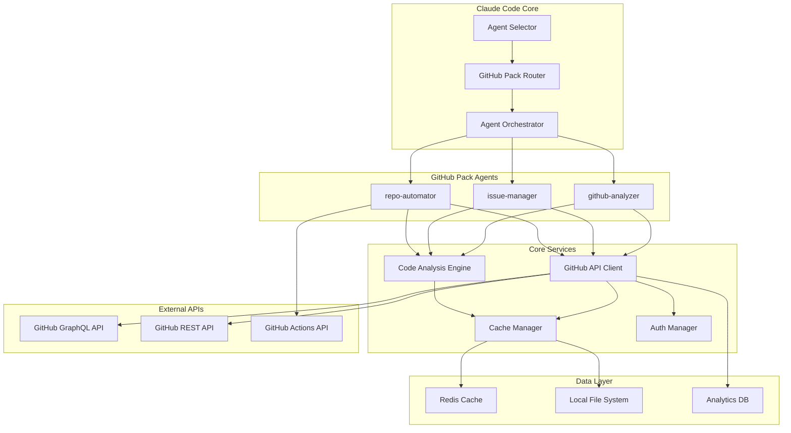

# 🔧 GitHub 프로젝트 분석 에이전트 기술 명세서

> **작성일**: 2025-09-20
> **목적**: GitHub 에이전트의 상세한 기술 스펙과 구현 방법 정의

---

## 📋 목차

1. [시스템 아키텍처](#시스템-아키텍처)
2. [에이전트 상세 스펙](#에이전트-상세-스펙)
3. [GitHub API 활용 명세](#github-api-활용-명세)
4. [데이터 모델 정의](#데이터-모델-정의)
5. [보안 요구사항](#보안-요구사항)
6. [성능 요구사항](#성능-요구사항)
7. [API 엔드포인트](#api-엔드포인트)
8. [에러 처리 전략](#에러-처리-전략)
9. [배포 및 운영](#배포-및-운영)

---

## 시스템 아키텍처

### 🏗️ 전체 아키텍처 다이어그램



### 🔧 기술 스택

```yaml
runtime:
  node_version: "18.x LTS"
  package_manager: "npm"

core_libraries:
  http_client: "axios ^1.6.0"
  graphql_client: "@apollo/client ^3.8.0"
  ast_parser: "tree-sitter ^0.20.0"
  cache: "ioredis ^5.3.0"
  crypto: "node:crypto"

language_parsers:
  javascript: "tree-sitter-javascript ^0.20.0"
  typescript: "tree-sitter-typescript ^0.20.0"
  python: "tree-sitter-python ^0.20.0"
  java: "tree-sitter-java ^0.20.0"
  go: "tree-sitter-go ^0.20.0"

analysis_tools:
  eslint: "^8.57.0"
  typescript: "^5.3.0"
  prettier: "^3.2.0"
  sonarjs: "^0.23.0"

testing:
  framework: "jest ^29.7.0"
  mocking: "jest-mock ^29.7.0"
  integration: "supertest ^6.3.0"
  e2e: "@playwright/test ^1.41.0"

monitoring:
  metrics: "prometheus-client ^0.15.0"
  logging: "winston ^3.11.0"
  tracing: "@opentelemetry/api ^1.7.0"
```

---

## 에이전트 상세 스펙

### 🔍 1. github-analyzer 에이전트

#### 기본 정보
```json
{
  "name": "github-analyzer",
  "version": "1.0.0",
  "description": "GitHub 리포지토리를 PROACTIVELY 분석하여 코드베이스 구조, 기술 스택, 품질 지표, 보안 현황을 종합적으로 파악하는 전문가입니다.",
  "model": "sonnet",
  "tools": ["Read", "Grep", "Glob", "WebFetch", "Bash"],
  "github_permissions": [
    "repo:read",
    "metadata:read",
    "security_events:read"
  ]
}
```

#### 핵심 기능 명세
```typescript
interface GitHubAnalyzer {
  // 리포지토리 종합 분석
  analyzeRepository(repoUrl: string): Promise<RepositoryAnalysis>;

  // 코드베이스 구조 분석
  analyzeCodeStructure(repository: Repository): Promise<CodeStructure>;

  // 기술 스택 감지
  detectTechStack(repository: Repository): Promise<TechStack>;

  // 품질 지표 계산
  calculateQualityMetrics(repository: Repository): Promise<QualityMetrics>;

  // 보안 취약점 스캔
  scanSecurityVulnerabilities(repository: Repository): Promise<SecurityScan>;

  // 의존성 분석
  analyzeDependencies(repository: Repository): Promise<DependencyAnalysis>;

  // 한국어 리포트 생성
  generateKoreanReport(analysis: RepositoryAnalysis): Promise<string>;
}
```

#### 자동 선택 트리거
```yaml
auto_trigger_keywords:
  primary:
    - "리포지토리 분석"
    - "코드베이스 분석"
    - "GitHub 프로젝트"
    - "repository analysis"

  secondary:
    - "기술 스택"
    - "코드 품질"
    - "프로젝트 구조"
    - "tech stack"

  patterns:
    - "github.com/[owner]/[repo]"
    - "analyze.*repository"
    - "분석.*깃헙"
```

#### 구현 클래스
```typescript
// github-analyzer.ts
export class GitHubAnalyzer implements ClaudeAgent {
  private apiClient: GitHubAPIClient;
  private codeAnalyzer: CodeAnalysisEngine;
  private cache: CacheManager;
  private logger: Logger;

  constructor(config: GitHubAnalyzerConfig) {
    this.apiClient = new GitHubAPIClient(config.github);
    this.codeAnalyzer = new CodeAnalysisEngine(config.analysis);
    this.cache = new CacheManager(config.cache);
    this.logger = new Logger('github-analyzer');
  }

  async analyzeRepository(repoUrl: string): Promise<RepositoryAnalysis> {
    const startTime = Date.now();
    this.logger.info(`리포지토리 분석 시작: ${repoUrl}`);

    try {
      // 1. 리포지토리 정보 수집
      const repository = await this.fetchRepositoryInfo(repoUrl);

      // 2. 병렬 분석 실행
      const [structure, techStack, quality, security, dependencies] =
        await Promise.all([
          this.analyzeCodeStructure(repository),
          this.detectTechStack(repository),
          this.calculateQualityMetrics(repository),
          this.scanSecurityVulnerabilities(repository),
          this.analyzeDependencies(repository)
        ]);

      // 3. 결과 통합
      const analysis: RepositoryAnalysis = {
        repository,
        structure,
        techStack,
        quality,
        security,
        dependencies,
        metadata: {
          analyzedAt: new Date(),
          duration: Date.now() - startTime,
          version: '1.0.0'
        }
      };

      // 4. 캐시 저장
      await this.cache.set(`analysis:${repoUrl}`, analysis, 'analysis_result');

      this.logger.info(`분석 완료: ${Date.now() - startTime}ms`);
      return analysis;

    } catch (error) {
      this.logger.error(`분석 실패: ${error.message}`, { repoUrl, error });
      throw new AnalysisError(`리포지토리 분석 중 오류 발생: ${error.message}`);
    }
  }

  private async fetchRepositoryInfo(repoUrl: string): Promise<Repository> {
    const [owner, repo] = this.parseRepositoryUrl(repoUrl);
    return await this.apiClient.getRepository(owner, repo);
  }

  private parseRepositoryUrl(url: string): [string, string] {
    const match = url.match(/github\.com\/([^\/]+)\/([^\/]+)/);
    if (!match) {
      throw new Error('Invalid GitHub repository URL');
    }
    return [match[1], match[2]];
  }
}
```

### 📋 2. issue-manager 에이전트

#### 기본 정보
```json
{
  "name": "issue-manager",
  "version": "1.0.0",
  "description": "GitHub 이슈와 PR을 PROACTIVELY 관리하는 전문가입니다. 자동 라벨링, 우선순위 설정, 담당자 배정, 코드 리뷰 자동화를 통해 효율적인 프로젝트 관리를 지원합니다.",
  "model": "sonnet",
  "tools": ["Read", "Write", "Edit", "WebFetch", "Bash"],
  "github_permissions": [
    "issues:write",
    "pull_requests:write",
    "repository_projects:write"
  ]
}
```

#### 핵심 기능 명세
```typescript
interface IssueManager {
  // 이슈 자동 분류
  categorizeIssue(issue: Issue): Promise<IssueCategory>;

  // 우선순위 자동 설정
  setPriority(issue: Issue): Promise<Priority>;

  // 라벨 자동 적용
  applyLabels(issue: Issue, category: IssueCategory): Promise<Label[]>;

  // 담당자 자동 배정
  assignReviewers(pullRequest: PullRequest): Promise<User[]>;

  // PR 자동 리뷰
  performAutomatedReview(pullRequest: PullRequest): Promise<ReviewResult>;

  // 워크플로우 상태 업데이트
  updateWorkflowStatus(item: Issue | PullRequest): Promise<void>;
}
```

#### ML 기반 분류 모델
```typescript
// issue-classifier.ts
export class IssueClassifier {
  private model: TensorFlowModel;
  private vectorizer: TextVectorizer;

  constructor() {
    this.loadModel();
    this.vectorizer = new TextVectorizer();
  }

  async classifyIssue(issue: Issue): Promise<Classification> {
    // 1. 텍스트 전처리
    const features = await this.extractFeatures(issue);

    // 2. 벡터화
    const vector = await this.vectorizer.transform(features);

    // 3. 모델 예측
    const prediction = await this.model.predict(vector);

    return {
      type: this.mapToIssueType(prediction.type),
      priority: this.mapToPriority(prediction.priority),
      confidence: prediction.confidence,
      labels: this.generateLabels(prediction)
    };
  }

  private async extractFeatures(issue: Issue): Promise<Features> {
    return {
      title: issue.title,
      body: issue.body,
      labels: issue.labels.map(l => l.name),
      author: issue.user.login,
      repository: issue.repository.name,
      hasCodeSnippet: /```/.test(issue.body),
      hasStackTrace: /at\s+\w+/.test(issue.body),
      hasErrorMessage: /(error|exception|fail)/i.test(issue.body)
    };
  }
}
```

### ⚙️ 3. repo-automator 에이전트

#### 기본 정보
```json
{
  "name": "repo-automator",
  "version": "1.0.0",
  "description": "GitHub Actions 워크플로우와 자동화 스크립트를 PROACTIVELY 생성하는 전문가입니다. CI/CD 파이프라인, 테스트 자동화, 배포 프로세스를 프로젝트 특성에 맞게 최적화하여 제공합니다.",
  "model": "sonnet",
  "tools": ["Write", "Edit", "Bash", "Read"],
  "github_permissions": [
    "actions:write",
    "contents:write",
    "administration:write"
  ]
}
```

#### 핵심 기능 명세
```typescript
interface RepoAutomator {
  // CI/CD 워크플로우 생성
  generateCICDWorkflow(repository: Repository): Promise<WorkflowConfig>;

  // 테스트 자동화 설정
  setupTestAutomation(repository: Repository): Promise<TestConfig>;

  // 배포 파이프라인 구성
  createDeploymentPipeline(repository: Repository): Promise<DeploymentConfig>;

  // 코드 품질 검사 자동화
  setupQualityGates(repository: Repository): Promise<QualityConfig>;

  // 의존성 업데이트 자동화
  configureDependencyUpdates(repository: Repository): Promise<DependencyConfig>;

  // 보안 스캔 자동화
  setupSecurityScanning(repository: Repository): Promise<SecurityConfig>;
}
```

#### 워크플로우 템플릿 엔진
```typescript
// workflow-generator.ts
export class WorkflowGenerator {
  private templates: Map<string, WorkflowTemplate>;

  constructor() {
    this.loadTemplates();
  }

  async generateWorkflow(
    projectType: ProjectType,
    requirements: Requirements
  ): Promise<string> {
    const template = this.templates.get(projectType);
    if (!template) {
      throw new Error(`Unsupported project type: ${projectType}`);
    }

    const context = this.buildContext(requirements);
    return await this.renderTemplate(template, context);
  }

  private async renderTemplate(
    template: WorkflowTemplate,
    context: Context
  ): Promise<string> {
    let workflow = template.base;

    // 조건부 섹션 처리
    for (const condition of template.conditionals) {
      if (this.evaluateCondition(condition, context)) {
        workflow = workflow.replace(
          condition.placeholder,
          condition.content
        );
      } else {
        workflow = workflow.replace(condition.placeholder, '');
      }
    }

    // 변수 치환
    for (const [key, value] of Object.entries(context)) {
      workflow = workflow.replace(
        new RegExp(`\\{\\{${key}\\}\\}`, 'g'),
        String(value)
      );
    }

    return workflow;
  }
}
```

#### 워크플로우 템플릿 예시
```yaml
# templates/react-typescript.yml
name: React TypeScript CI/CD

on:
  push:
    branches: [ main, develop ]
  pull_request:
    branches: [ main ]

jobs:
  test:
    runs-on: ubuntu-latest

    strategy:
      matrix:
        node-version: [18.x, 20.x]

    steps:
    - uses: actions/checkout@v4

    - name: Node.js 설정
      uses: actions/setup-node@v4
      with:
        node-version: ${{ matrix.node-version }}
        cache: 'npm'

    - name: 의존성 설치
      run: npm ci

    - name: 타입 체크
      run: npm run type-check

    - name: 린트 검사
      run: npm run lint

    - name: 테스트 실행
      run: npm run test:coverage

    - name: 코드 커버리지 업로드
      uses: codecov/codecov-action@v3
      with:
        file: ./coverage/lcov.info

  build:
    needs: test
    runs-on: ubuntu-latest

    steps:
    - uses: actions/checkout@v4

    - name: Node.js 설정
      uses: actions/setup-node@v4
      with:
        node-version: '20.x'
        cache: 'npm'

    - name: 의존성 설치
      run: npm ci

    - name: 프로덕션 빌드
      run: npm run build

    - name: 빌드 아티팩트 업로드
      uses: actions/upload-artifact@v4
      with:
        name: build-files
        path: dist/

  {{#if deployment_enabled}}
  deploy:
    needs: build
    runs-on: ubuntu-latest
    if: github.ref == 'refs/heads/main'

    steps:
    - name: 빌드 아티팩트 다운로드
      uses: actions/download-artifact@v4
      with:
        name: build-files
        path: dist/

    - name: {{deployment_target}}에 배포
      run: |
        {{deployment_script}}
  {{/if}}
```

---

## GitHub API 활용 명세

### 🔌 GraphQL API 클라이언트

#### 연결 설정
```typescript
// github-api-client.ts
export class GitHubAPIClient {
  private client: ApolloClient<any>;
  private rateLimiter: RateLimiter;
  private cache: CacheManager;

  constructor(config: GitHubAPIConfig) {
    this.client = new ApolloClient({
      uri: 'https://api.github.com/graphql',
      headers: {
        'Authorization': `Bearer ${config.token}`,
        'Accept': 'application/vnd.github.v4+json',
        'X-GitHub-Api-Version': '2022-11-28'
      },
      cache: new InMemoryCache({
        typePolicies: {
          Repository: {
            fields: {
              issues: {
                merge: true
              }
            }
          }
        }
      })
    });

    this.rateLimiter = new RateLimiter({
      tokensPerInterval: config.rateLimit.requests,
      interval: config.rateLimit.window
    });

    this.cache = new CacheManager(config.cache);
  }
}
```

#### 핵심 쿼리
```graphql
# 리포지토리 종합 정보 조회
query GetRepositoryOverview($owner: String!, $name: String!) {
  repository(owner: $owner, name: $name) {
    id
    name
    description
    url
    homepageUrl

    # 기본 통계
    stargazerCount
    forkCount
    watchers { totalCount }

    # 언어 정보
    primaryLanguage { name color }
    languages(first: 20, orderBy: {field: SIZE, direction: DESC}) {
      edges {
        size
        node {
          name
          color
        }
      }
    }

    # 토픽과 라이선스
    repositoryTopics(first: 20) {
      nodes {
        topic { name }
      }
    }
    licenseInfo {
      name
      spdxId
    }

    # 최근 활동
    defaultBranchRef {
      name
      target {
        ... on Commit {
          history(first: 1) {
            nodes {
              committedDate
              message
              author {
                user { login }
              }
            }
          }
        }
      }
    }

    # 이슈와 PR 현황
    issues(states: OPEN) { totalCount }
    pullRequests(states: OPEN) { totalCount }

    # 최근 릴리스
    releases(first: 1, orderBy: {field: CREATED_AT, direction: DESC}) {
      nodes {
        tagName
        name
        publishedAt
        isPrerelease
      }
    }

    # 보안 취약점
    vulnerabilityAlerts(first: 10, states: OPEN) {
      nodes {
        securityVulnerability {
          severity
          advisory {
            summary
            publishedAt
          }
        }
      }
    }
  }

  # Rate Limit 정보
  rateLimit {
    limit
    cost
    remaining
    resetAt
  }
}
```

```graphql
# 파일 구조 조회 (재귀적)
query GetFileStructure($owner: String!, $name: String!, $expression: String!) {
  repository(owner: $owner, name: $name) {
    object(expression: $expression) {
      ... on Tree {
        entries {
          name
          type
          mode
          path
          object {
            ... on Blob {
              byteSize
              text
              isBinary
            }
            ... on Tree {
              entries {
                name
                type
                path
                object {
                  ... on Blob {
                    byteSize
                    isBinary
                  }
                }
              }
            }
          }
        }
      }
    }
  }
}
```

```graphql
# 이슈 및 PR 상세 조회
query GetIssuesAndPRs($owner: String!, $name: String!, $first: Int = 20) {
  repository(owner: $owner, name: $name) {
    issues(first: $first, states: OPEN, orderBy: {field: CREATED_AT, direction: DESC}) {
      nodes {
        id
        number
        title
        body
        state
        createdAt
        updatedAt

        author {
          login
          ... on User {
            name
            email
          }
        }

        labels(first: 10) {
          nodes {
            name
            color
            description
          }
        }

        assignees(first: 5) {
          nodes {
            login
            name
          }
        }

        milestone {
          title
          dueOn
        }

        comments { totalCount }
        reactions { totalCount }
      }
    }

    pullRequests(first: $first, states: OPEN, orderBy: {field: CREATED_AT, direction: DESC}) {
      nodes {
        id
        number
        title
        body
        state
        createdAt
        updatedAt

        author {
          login
          ... on User {
            name
          }
        }

        baseRefName
        headRefName

        mergeable
        merged
        mergedAt

        additions
        deletions
        changedFiles

        reviewDecision
        reviewRequests(first: 5) {
          nodes {
            requestedReviewer {
              ... on User {
                login
                name
              }
            }
          }
        }

        reviews(first: 5, states: [APPROVED, CHANGES_REQUESTED, COMMENTED]) {
          nodes {
            state
            author {
              login
            }
            submittedAt
          }
        }

        checks: commits(last: 1) {
          nodes {
            commit {
              checkSuites(first: 10) {
                nodes {
                  status
                  conclusion
                  app {
                    name
                  }
                  checkRuns(first: 10) {
                    nodes {
                      name
                      status
                      conclusion
                    }
                  }
                }
              }
            }
          }
        }
      }
    }
  }
}
```

### 📊 API 사용량 모니터링

```typescript
// rate-limit-monitor.ts
export class RateLimitMonitor {
  private metrics: Map<string, RateLimitMetrics> = new Map();
  private alerts: AlertManager;

  constructor(alertManager: AlertManager) {
    this.alerts = alertManager;
  }

  async trackAPICall(
    endpoint: string,
    cost: number,
    remaining: number,
    resetAt: Date
  ): Promise<void> {
    const current = this.metrics.get(endpoint) || {
      totalCalls: 0,
      totalCost: 0,
      lastResetAt: resetAt,
      remaining: remaining
    };

    current.totalCalls++;
    current.totalCost += cost;
    current.remaining = remaining;

    this.metrics.set(endpoint, current);

    // 임계값 체크
    if (remaining < 500) {
      await this.alerts.send({
        level: 'warning',
        message: `GitHub API rate limit 부족: ${remaining}개 남음`,
        endpoint,
        resetAt
      });
    }

    if (remaining < 100) {
      await this.alerts.send({
        level: 'critical',
        message: `GitHub API rate limit 심각: ${remaining}개 남음`,
        endpoint,
        resetAt
      });
    }
  }

  getUsageReport(): UsageReport {
    const total = Array.from(this.metrics.values()).reduce(
      (acc, metric) => ({
        calls: acc.calls + metric.totalCalls,
        cost: acc.cost + metric.totalCost
      }),
      { calls: 0, cost: 0 }
    );

    return {
      totalCalls: total.calls,
      totalCost: total.cost,
      byEndpoint: Object.fromEntries(this.metrics),
      efficiency: total.cost / total.calls // 호출당 평균 비용
    };
  }
}
```

---

## 데이터 모델 정의

### 🗂️ 핵심 인터페이스

```typescript
// types/repository.ts
export interface Repository {
  id: string;
  name: string;
  fullName: string;
  description?: string;
  url: string;
  htmlUrl: string;
  homepageUrl?: string;

  owner: {
    login: string;
    type: 'User' | 'Organization';
    avatarUrl: string;
  };

  visibility: 'public' | 'private' | 'internal';
  defaultBranch: string;

  // 통계 정보
  metrics: {
    stars: number;
    forks: number;
    watchers: number;
    openIssues: number;
    openPRs: number;
    size: number; // KB 단위
  };

  // 언어 정보
  languages: Language[];
  primaryLanguage?: Language;

  // 메타데이터
  topics: string[];
  license?: {
    name: string;
    spdxId: string;
  };

  // 시간 정보
  createdAt: Date;
  updatedAt: Date;
  pushedAt: Date;

  // 설정
  hasIssues: boolean;
  hasProjects: boolean;
  hasWiki: boolean;
  hasPages: boolean;
  hasActions: boolean;

  // 보안
  securityAndAnalysis?: {
    secretScanning?: boolean;
    dependencyGraph?: boolean;
    vulnerabilityAlerts?: boolean;
  };
}

export interface Language {
  name: string;
  color: string;
  size: number;
  percentage: number;
}
```

```typescript
// types/analysis.ts
export interface RepositoryAnalysis {
  repository: Repository;
  structure: CodeStructure;
  techStack: TechStack;
  quality: QualityMetrics;
  security: SecurityScan;
  dependencies: DependencyAnalysis;
  metadata: AnalysisMetadata;
}

export interface CodeStructure {
  totalFiles: number;
  totalLines: number;
  totalSize: number; // bytes

  fileTypes: {
    [extension: string]: {
      count: number;
      lines: number;
      size: number;
    };
  };

  directories: DirectoryNode[];

  languageDistribution: {
    [language: string]: {
      files: number;
      lines: number;
      percentage: number;
    };
  };

  complexity: {
    average: number;
    max: number;
    distribution: ComplexityDistribution;
  };
}

export interface TechStack {
  framework?: string;
  runtime: string;
  packageManager?: string;
  buildTool?: string;
  testFramework?: string;
  linter?: string;
  bundler?: string;

  dependencies: {
    production: Dependency[];
    development: Dependency[];
    peer: Dependency[];
  };

  devtools: {
    ci: string[];
    deployment: string[];
    monitoring: string[];
  };

  patterns: {
    architecture: ArchitecturePattern[];
    design: DesignPattern[];
  };
}

export interface QualityMetrics {
  overall: {
    score: number; // 0-100
    grade: 'A' | 'B' | 'C' | 'D' | 'F';
  };

  maintainability: {
    score: number;
    issues: CodeIssue[];
  };

  reliability: {
    score: number;
    bugs: number;
    criticalIssues: number;
  };

  security: {
    score: number;
    vulnerabilities: number;
    hotspots: SecurityHotspot[];
  };

  coverage: {
    line: number;
    branch: number;
    function: number;
  };

  duplication: {
    percentage: number;
    blocks: number;
    lines: number;
  };

  complexity: {
    cyclomatic: number;
    cognitive: number;
    files: ComplexityFile[];
  };
}

export interface SecurityScan {
  summary: {
    totalVulnerabilities: number;
    criticalCount: number;
    highCount: number;
    mediumCount: number;
    lowCount: number;
  };

  vulnerabilities: Vulnerability[];

  owaspTop10: {
    [category: string]: Vulnerability[];
  };

  dependencies: {
    vulnerable: number;
    total: number;
    updates: DependencyUpdate[];
  };

  secretsDetection: {
    found: boolean;
    patterns: SecretPattern[];
  };

  codeScanning: {
    enabled: boolean;
    alerts: CodeScanningAlert[];
  };
}
```

### 📋 데이터 검증

```typescript
// validators/repository-validator.ts
import { z } from 'zod';

export const RepositorySchema = z.object({
  id: z.string().min(1),
  name: z.string().min(1).max(100),
  fullName: z.string().regex(/^[a-zA-Z0-9._-]+\/[a-zA-Z0-9._-]+$/),
  description: z.string().max(500).optional(),
  url: z.string().url(),

  owner: z.object({
    login: z.string().min(1),
    type: z.enum(['User', 'Organization']),
    avatarUrl: z.string().url()
  }),

  metrics: z.object({
    stars: z.number().min(0),
    forks: z.number().min(0),
    watchers: z.number().min(0),
    openIssues: z.number().min(0),
    openPRs: z.number().min(0),
    size: z.number().min(0)
  }),

  languages: z.array(z.object({
    name: z.string(),
    color: z.string().regex(/^#[0-9A-Fa-f]{6}$/),
    size: z.number().min(0),
    percentage: z.number().min(0).max(100)
  }))
});

export function validateRepository(data: unknown): Repository {
  return RepositorySchema.parse(data);
}
```

---

## 보안 요구사항

### 🔐 인증 및 권한 관리

#### Fine-Grained Personal Access Token 지원
```typescript
// auth/token-manager.ts
export class TokenManager {
  private keyring: SecureKeyring;
  private validator: TokenValidator;

  constructor() {
    this.keyring = new SecureKeyring();
    this.validator = new TokenValidator();
  }

  async storeToken(token: string, scopes: string[]): Promise<void> {
    // 토큰 검증
    const validation = await this.validator.validate(token);
    if (!validation.valid) {
      throw new Error(`Invalid token: ${validation.error}`);
    }

    // 스코프 확인
    const hasRequiredScopes = this.validateScopes(validation.scopes, scopes);
    if (!hasRequiredScopes) {
      throw new Error('Token does not have required scopes');
    }

    // 암호화 저장
    const encrypted = await this.keyring.encrypt(token);
    await this.keyring.store('github_token', encrypted);
  }

  async getToken(): Promise<string> {
    const encrypted = await this.keyring.retrieve('github_token');
    if (!encrypted) {
      throw new Error('No GitHub token found');
    }

    return await this.keyring.decrypt(encrypted);
  }

  private validateScopes(tokenScopes: string[], requiredScopes: string[]): boolean {
    return requiredScopes.every(required =>
      tokenScopes.some(scope => scope.includes(required.split(':')[0]))
    );
  }
}
```

#### 권한 체크 미들웨어
```typescript
// auth/permission-middleware.ts
export class PermissionMiddleware {
  private tokenManager: TokenManager;
  private logger: Logger;

  constructor(tokenManager: TokenManager) {
    this.tokenManager = tokenManager;
    this.logger = new Logger('permission-middleware');
  }

  async checkPermissions(
    agent: string,
    action: string,
    resource?: string
  ): Promise<void> {
    const requiredPermissions = this.getRequiredPermissions(agent, action);
    const token = await this.tokenManager.getToken();

    const validation = await this.validateTokenPermissions(token, requiredPermissions);

    if (!validation.valid) {
      this.logger.warn('Permission denied', {
        agent,
        action,
        resource,
        missing: validation.missing
      });

      throw new PermissionError(
        `Insufficient permissions for ${agent}:${action}. Missing: ${validation.missing.join(', ')}`
      );
    }

    this.logger.info('Permission granted', { agent, action, resource });
  }

  private getRequiredPermissions(agent: string, action: string): string[] {
    const permissions: Record<string, Record<string, string[]>> = {
      'github-analyzer': {
        'analyze-repository': ['repo:read', 'metadata:read'],
        'scan-security': ['repo:read', 'security_events:read']
      },
      'issue-manager': {
        'manage-issues': ['issues:write'],
        'manage-prs': ['pull_requests:write'],
        'manage-projects': ['repository_projects:write']
      },
      'repo-automator': {
        'create-workflows': ['actions:write', 'contents:write'],
        'manage-settings': ['administration:write']
      }
    };

    return permissions[agent]?.[action] || [];
  }
}
```

### 🛡️ 데이터 보호

#### 민감 정보 필터링
```typescript
// security/data-sanitizer.ts
export class DataSanitizer {
  private sensitivePatterns: RegExp[];

  constructor() {
    this.sensitivePatterns = [
      /ghp_[a-zA-Z0-9]{36}/, // GitHub Personal Access Token
      /ghs_[a-zA-Z0-9]{36}/, // GitHub Server-to-Server Token
      /github_pat_[a-zA-Z0-9_]{82}/, // Fine-grained PAT
      /sk-[a-zA-Z0-9]{48}/, // OpenAI API Key
      /AIza[0-9A-Za-z_-]{35}/, // Google API Key
      /[0-9a-f]{8}-[0-9a-f]{4}-[0-9a-f]{4}-[0-9a-f]{4}-[0-9a-f]{12}/, // UUID
      /(?:password|passwd|pwd)\s*[:=]\s*["']?[^\s"']+/i, // Passwords
      /(?:api[_-]?key|apikey)\s*[:=]\s*["']?[^\s"']+/i, // API Keys
    ];
  }

  sanitizeContent(content: string): string {
    let sanitized = content;

    for (const pattern of this.sensitivePatterns) {
      sanitized = sanitized.replace(pattern, '[REDACTED]');
    }

    return sanitized;
  }

  scanForSecrets(content: string): SecretMatch[] {
    const matches: SecretMatch[] = [];

    for (const pattern of this.sensitivePatterns) {
      const regex = new RegExp(pattern, 'g');
      let match;

      while ((match = regex.exec(content)) !== null) {
        matches.push({
          type: this.getSecretType(pattern),
          value: match[0],
          position: match.index,
          confidence: this.calculateConfidence(match[0], pattern)
        });
      }
    }

    return matches;
  }

  private getSecretType(pattern: RegExp): string {
    const patternMap: Record<string, string> = {
      '/ghp_[a-zA-Z0-9]{36}/': 'github_token',
      '/sk-[a-zA-Z0-9]{48}/': 'openai_key',
      '/AIza[0-9A-Za-z_-]{35}/': 'google_api_key'
    };

    return patternMap[pattern.toString()] || 'unknown_secret';
  }
}
```

---

## 성능 요구사항

### ⚡ 응답 시간 목표

```yaml
performance_targets:
  repository_analysis:
    small_repo: # < 100 files
      target: 30s
      max: 60s

    medium_repo: # 100-1000 files
      target: 2m
      max: 5m

    large_repo: # 1000+ files
      target: 5m
      max: 15m

  api_responses:
    github_api_call:
      target: 500ms
      max: 2s

    cache_lookup:
      target: 10ms
      max: 50ms

    database_query:
      target: 100ms
      max: 500ms

  memory_usage:
    baseline: 50MB
    max_per_analysis: 200MB
    cleanup_threshold: 500MB
```

### 🚀 최적화 전략

#### 병렬 처리 최적화
```typescript
// performance/parallel-processor.ts
export class ParallelProcessor<T, R> {
  private concurrency: number;
  private queue: (() => Promise<R>)[] = [];
  private running: number = 0;
  private results: (R | Error)[] = [];

  constructor(concurrency: number = 5) {
    this.concurrency = concurrency;
  }

  async processAll(items: T[], processor: (item: T) => Promise<R>): Promise<R[]> {
    // 작업을 청크로 분할
    const chunks = this.chunkArray(items, this.concurrency);
    const results: R[] = [];

    for (const chunk of chunks) {
      // 청크 내 작업들을 병렬 실행
      const chunkPromises = chunk.map(item =>
        this.executeWithRetry(() => processor(item))
      );

      const chunkResults = await Promise.allSettled(chunkPromises);

      // 성공한 결과만 수집
      results.push(...chunkResults
        .filter(result => result.status === 'fulfilled')
        .map(result => (result as PromiseFulfilledResult<R>).value)
      );

      // API Rate Limit 고려한 지연
      await this.delay(100);
    }

    return results;
  }

  private async executeWithRetry<T>(
    fn: () => Promise<T>,
    maxRetries: number = 3
  ): Promise<T> {
    for (let attempt = 1; attempt <= maxRetries; attempt++) {
      try {
        return await fn();
      } catch (error) {
        if (attempt === maxRetries) {
          throw error;
        }

        // 지수 백오프
        const delay = Math.min(1000 * Math.pow(2, attempt - 1), 10000);
        await this.delay(delay);
      }
    }

    throw new Error('Max retries exceeded');
  }

  private chunkArray<T>(array: T[], size: number): T[][] {
    const chunks: T[][] = [];
    for (let i = 0; i < array.length; i += size) {
      chunks.push(array.slice(i, i + size));
    }
    return chunks;
  }

  private delay(ms: number): Promise<void> {
    return new Promise(resolve => setTimeout(resolve, ms));
  }
}
```

#### 캐싱 전략
```typescript
// performance/cache-strategy.ts
export class CacheStrategy {
  private l1Cache: Map<string, CacheEntry> = new Map(); // 메모리 캐시
  private l2Cache: Redis; // Redis 캐시
  private l3Cache: FileSystem; // 파일 시스템 캐시

  constructor(config: CacheConfig) {
    this.l2Cache = new Redis(config.redis);
    this.l3Cache = new FileSystem(config.filesystem);
  }

  async get<T>(key: string, type: CacheType): Promise<T | null> {
    // L1: 메모리 캐시 확인
    const l1Entry = this.l1Cache.get(key);
    if (l1Entry && !this.isExpired(l1Entry)) {
      return l1Entry.data as T;
    }

    // L2: Redis 캐시 확인
    const l2Data = await this.l2Cache.get(key);
    if (l2Data) {
      const parsed = JSON.parse(l2Data) as T;
      // L1 캐시에 복사
      this.setL1Cache(key, parsed, type);
      return parsed;
    }

    // L3: 파일 시스템 캐시 확인 (장기 보관용)
    if (type === 'long_term') {
      const l3Data = await this.l3Cache.read(key);
      if (l3Data) {
        const parsed = JSON.parse(l3Data) as T;
        // 상위 캐시들에 복사
        await this.set(key, parsed, type);
        return parsed;
      }
    }

    return null;
  }

  async set<T>(key: string, data: T, type: CacheType): Promise<void> {
    const ttl = this.getTTL(type);

    // L1: 메모리 캐시
    this.setL1Cache(key, data, type);

    // L2: Redis 캐시
    await this.l2Cache.setex(key, ttl, JSON.stringify(data));

    // L3: 파일 시스템 캐시 (장기 보관용만)
    if (type === 'long_term') {
      await this.l3Cache.write(key, JSON.stringify(data));
    }
  }

  private getTTL(type: CacheType): number {
    const ttlMap: Record<CacheType, number> = {
      'api_response': 600,      // 10분
      'analysis_result': 3600,  // 1시간
      'repository_info': 1800,  // 30분
      'long_term': 86400        // 24시간
    };

    return ttlMap[type];
  }

  private setL1Cache<T>(key: string, data: T, type: CacheType): void {
    const entry: CacheEntry = {
      data,
      timestamp: Date.now(),
      ttl: this.getTTL(type) * 1000 // 밀리초로 변환
    };

    this.l1Cache.set(key, entry);

    // 메모리 사용량 제한
    if (this.l1Cache.size > 1000) {
      this.evictOldestEntries(100);
    }
  }

  private evictOldestEntries(count: number): void {
    const entries = Array.from(this.l1Cache.entries())
      .sort(([, a], [, b]) => a.timestamp - b.timestamp)
      .slice(0, count);

    for (const [key] of entries) {
      this.l1Cache.delete(key);
    }
  }
}
```

---

## API 엔드포인트

### 🌐 REST API 설계

```typescript
// api/routes.ts
import { Router } from 'express';
import { GitHubAnalyzer } from '../agents/github-analyzer';
import { IssueManager } from '../agents/issue-manager';
import { RepoAutomator } from '../agents/repo-automator';

export const createAPIRouter = (): Router => {
  const router = Router();

  // GitHub 분석 엔드포인트
  router.post('/api/v1/analyze/repository', async (req, res) => {
    try {
      const { repositoryUrl, options } = req.body;

      const analyzer = new GitHubAnalyzer();
      const analysis = await analyzer.analyzeRepository(repositoryUrl);

      res.json({
        success: true,
        data: analysis,
        meta: {
          timestamp: new Date().toISOString(),
          version: '1.0.0'
        }
      });
    } catch (error) {
      res.status(500).json({
        success: false,
        error: {
          message: error.message,
          code: 'ANALYSIS_FAILED'
        }
      });
    }
  });

  // 이슈 관리 엔드포인트
  router.post('/api/v1/issues/categorize', async (req, res) => {
    try {
      const { repositoryUrl, issueNumber } = req.body;

      const manager = new IssueManager();
      const category = await manager.categorizeIssue(repositoryUrl, issueNumber);

      res.json({
        success: true,
        data: category
      });
    } catch (error) {
      res.status(500).json({
        success: false,
        error: {
          message: error.message,
          code: 'CATEGORIZATION_FAILED'
        }
      });
    }
  });

  // 자동화 설정 엔드포인트
  router.post('/api/v1/automation/setup', async (req, res) => {
    try {
      const { repositoryUrl, type } = req.body;

      const automator = new RepoAutomator();
      const config = await automator.setupAutomation(repositoryUrl, type);

      res.json({
        success: true,
        data: config
      });
    } catch (error) {
      res.status(500).json({
        success: false,
        error: {
          message: error.message,
          code: 'AUTOMATION_SETUP_FAILED'
        }
      });
    }
  });

  return router;
};
```

### 📝 API 문서 (OpenAPI 3.0)

```yaml
# api-spec.yml
openapi: 3.0.3
info:
  title: GitHub Agent API
  description: GitHub 프로젝트 분석 및 자동화를 위한 API
  version: 1.0.0
  contact:
    name: GitHub Agent Team
    email: support@example.com

servers:
  - url: http://localhost:3000
    description: 개발 서버
  - url: https://api.github-agent.com
    description: 프로덕션 서버

paths:
  /api/v1/analyze/repository:
    post:
      summary: 리포지토리 종합 분석
      description: 지정된 GitHub 리포지토리의 코드베이스, 품질, 보안 등을 종합 분석합니다.
      tags:
        - Analysis
      requestBody:
        required: true
        content:
          application/json:
            schema:
              type: object
              required:
                - repositoryUrl
              properties:
                repositoryUrl:
                  type: string
                  format: uri
                  example: "https://github.com/microsoft/vscode"
                  description: 분석할 GitHub 리포지토리 URL
                options:
                  type: object
                  properties:
                    includeTests:
                      type: boolean
                      default: true
                    includeDependencies:
                      type: boolean
                      default: true
                    securityScan:
                      type: boolean
                      default: true
      responses:
        '200':
          description: 분석 완료
          content:
            application/json:
              schema:
                type: object
                properties:
                  success:
                    type: boolean
                    example: true
                  data:
                    $ref: '#/components/schemas/RepositoryAnalysis'
                  meta:
                    type: object
                    properties:
                      timestamp:
                        type: string
                        format: date-time
                      version:
                        type: string
                        example: "1.0.0"
        '400':
          description: 잘못된 요청
          content:
            application/json:
              schema:
                $ref: '#/components/schemas/Error'
        '500':
          description: 서버 오류
          content:
            application/json:
              schema:
                $ref: '#/components/schemas/Error'

components:
  schemas:
    RepositoryAnalysis:
      type: object
      properties:
        repository:
          $ref: '#/components/schemas/Repository'
        structure:
          $ref: '#/components/schemas/CodeStructure'
        techStack:
          $ref: '#/components/schemas/TechStack'
        quality:
          $ref: '#/components/schemas/QualityMetrics'
        security:
          $ref: '#/components/schemas/SecurityScan'

    Repository:
      type: object
      properties:
        id:
          type: string
        name:
          type: string
        fullName:
          type: string
        description:
          type: string
        url:
          type: string
          format: uri

    Error:
      type: object
      properties:
        success:
          type: boolean
          example: false
        error:
          type: object
          properties:
            message:
              type: string
            code:
              type: string
```

---

## 에러 처리 전략

### 🚨 에러 분류 및 처리

```typescript
// errors/github-agent-errors.ts
export abstract class GitHubAgentError extends Error {
  abstract readonly code: string;
  abstract readonly httpStatus: number;
  abstract readonly retryable: boolean;

  constructor(message: string, public readonly context?: any) {
    super(message);
    this.name = this.constructor.name;
  }
}

export class GitHubAPIError extends GitHubAgentError {
  readonly code = 'GITHUB_API_ERROR';
  readonly httpStatus = 502;
  readonly retryable = true;

  constructor(message: string, public readonly statusCode: number, context?: any) {
    super(message, context);
  }
}

export class RateLimitError extends GitHubAgentError {
  readonly code = 'RATE_LIMIT_EXCEEDED';
  readonly httpStatus = 429;
  readonly retryable = true;

  constructor(public readonly resetAt: Date, context?: any) {
    super(`Rate limit exceeded. Resets at ${resetAt.toISOString()}`, context);
  }
}

export class AnalysisError extends GitHubAgentError {
  readonly code = 'ANALYSIS_FAILED';
  readonly httpStatus = 500;
  readonly retryable = false;

  constructor(message: string, public readonly step: string, context?: any) {
    super(message, context);
  }
}

export class AuthenticationError extends GitHubAgentError {
  readonly code = 'AUTHENTICATION_FAILED';
  readonly httpStatus = 401;
  readonly retryable = false;

  constructor(message: string = 'GitHub authentication failed', context?: any) {
    super(message, context);
  }
}

export class PermissionError extends GitHubAgentError {
  readonly code = 'INSUFFICIENT_PERMISSIONS';
  readonly httpStatus = 403;
  readonly retryable = false;

  constructor(message: string, public readonly requiredScopes: string[], context?: any) {
    super(message, context);
  }
}
```

### 🔄 에러 복구 전략

```typescript
// errors/error-handler.ts
export class ErrorHandler {
  private logger: Logger;
  private metrics: MetricsCollector;

  constructor(logger: Logger, metrics: MetricsCollector) {
    this.logger = logger;
    this.metrics = metrics;
  }

  async handleError(error: Error, context: ErrorContext): Promise<ErrorHandlingResult> {
    // 에러 메트릭 수집
    this.metrics.incrementCounter('errors_total', {
      type: error.constructor.name,
      operation: context.operation
    });

    // 에러 로깅
    this.logger.error('Error occurred', {
      error: error.message,
      stack: error.stack,
      context
    });

    if (error instanceof GitHubAgentError) {
      return await this.handleKnownError(error, context);
    }

    return await this.handleUnknownError(error, context);
  }

  private async handleKnownError(
    error: GitHubAgentError,
    context: ErrorContext
  ): Promise<ErrorHandlingResult> {
    switch (error.constructor) {
      case RateLimitError:
        return await this.handleRateLimit(error as RateLimitError, context);

      case GitHubAPIError:
        return await this.handleAPIError(error as GitHubAPIError, context);

      case AuthenticationError:
        return await this.handleAuthError(error as AuthenticationError, context);

      case PermissionError:
        return await this.handlePermissionError(error as PermissionError, context);

      default:
        return {
          action: 'fail',
          message: error.message,
          retryAfter: null
        };
    }
  }

  private async handleRateLimit(
    error: RateLimitError,
    context: ErrorContext
  ): Promise<ErrorHandlingResult> {
    const retryAfter = error.resetAt.getTime() - Date.now();

    if (retryAfter > 0 && retryAfter < 3600000) { // 1시간 이내
      return {
        action: 'retry',
        message: `Rate limit exceeded. Retrying after ${Math.ceil(retryAfter / 1000)}s`,
        retryAfter
      };
    }

    return {
      action: 'fail',
      message: 'Rate limit exceeded for too long',
      retryAfter: null
    };
  }

  private async handleAPIError(
    error: GitHubAPIError,
    context: ErrorContext
  ): Promise<ErrorHandlingResult> {
    // 일시적 오류인 경우 재시도
    if (error.statusCode >= 500 && error.statusCode < 600) {
      const backoffDelay = Math.min(
        1000 * Math.pow(2, context.retryCount || 0),
        30000
      );

      return {
        action: 'retry',
        message: `Server error ${error.statusCode}. Retrying in ${backoffDelay}ms`,
        retryAfter: backoffDelay
      };
    }

    return {
      action: 'fail',
      message: error.message,
      retryAfter: null
    };
  }

  private async handleAuthError(
    error: AuthenticationError,
    context: ErrorContext
  ): Promise<ErrorHandlingResult> {
    // 토큰 갱신 시도
    try {
      await this.refreshToken();
      return {
        action: 'retry',
        message: 'Token refreshed. Retrying operation',
        retryAfter: 0
      };
    } catch (refreshError) {
      return {
        action: 'fail',
        message: 'Authentication failed and token refresh failed',
        retryAfter: null
      };
    }
  }

  private async refreshToken(): Promise<void> {
    // 토큰 갱신 로직 구현
    throw new Error('Token refresh not implemented');
  }
}
```

---

## 배포 및 운영

### 🚀 배포 전략

#### Docker 컨테이너화
```dockerfile
# Dockerfile
FROM node:18-alpine AS builder

WORKDIR /app

# 의존성 설치
COPY package*.json ./
RUN npm ci --only=production && npm cache clean --force

# 소스 코드 복사 및 빌드
COPY . .
RUN npm run build

# 프로덕션 이미지
FROM node:18-alpine AS production

# 보안을 위한 non-root 사용자 생성
RUN addgroup -g 1001 -S nodejs && \
    adduser -S github-agent -u 1001

WORKDIR /app

# 필요한 패키지만 복사
COPY --from=builder --chown=github-agent:nodejs /app/dist ./dist
COPY --from=builder --chown=github-agent:nodejs /app/node_modules ./node_modules
COPY --from=builder --chown=github-agent:nodejs /app/package.json ./package.json

# Tree-sitter 바이너리 설치
RUN apk add --no-cache python3 make g++ && \
    npm rebuild tree-sitter && \
    apk del python3 make g++

USER github-agent

EXPOSE 3000

# 헬스체크
HEALTHCHECK --interval=30s --timeout=3s --start-period=5s --retries=3 \
  CMD node -e "require('http').get('http://localhost:3000/health', (res) => { process.exit(res.statusCode === 200 ? 0 : 1) })"

CMD ["node", "dist/index.js"]
```

#### Docker Compose 설정
```yaml
# docker-compose.yml
version: '3.8'

services:
  github-agent:
    build: .
    ports:
      - "3000:3000"
    environment:
      - NODE_ENV=production
      - GITHUB_TOKEN=${GITHUB_TOKEN}
      - REDIS_URL=redis://redis:6379
      - LOG_LEVEL=info
    depends_on:
      - redis
    volumes:
      - ./logs:/app/logs
    restart: unless-stopped
    deploy:
      resources:
        limits:
          memory: 512M
          cpus: '0.5'
        reservations:
          memory: 256M
          cpus: '0.25'

  redis:
    image: redis:7-alpine
    ports:
      - "6379:6379"
    volumes:
      - redis_data:/data
    command: redis-server --appendonly yes --maxmemory 256mb --maxmemory-policy allkeys-lru
    restart: unless-stopped

  nginx:
    image: nginx:alpine
    ports:
      - "80:80"
      - "443:443"
    volumes:
      - ./nginx.conf:/etc/nginx/nginx.conf
      - ./ssl:/etc/nginx/ssl
    depends_on:
      - github-agent
    restart: unless-stopped

volumes:
  redis_data:
```

### 📊 모니터링 및 관찰성

#### 메트릭 수집
```typescript
// monitoring/metrics.ts
import { register, Counter, Histogram, Gauge } from 'prom-client';

export class Metrics {
  private static instance: Metrics;

  public readonly requestDuration: Histogram<string>;
  public readonly requestTotal: Counter<string>;
  public readonly analysisErrors: Counter<string>;
  public readonly activeAnalyses: Gauge<string>;
  public readonly cacheHitRate: Gauge<string>;

  private constructor() {
    this.requestDuration = new Histogram({
      name: 'github_agent_request_duration_seconds',
      help: 'Request duration in seconds',
      labelNames: ['method', 'route', 'status_code'],
      buckets: [0.1, 0.5, 1, 2, 5, 10, 30, 60]
    });

    this.requestTotal = new Counter({
      name: 'github_agent_requests_total',
      help: 'Total number of requests',
      labelNames: ['method', 'route', 'status_code']
    });

    this.analysisErrors = new Counter({
      name: 'github_agent_analysis_errors_total',
      help: 'Total number of analysis errors',
      labelNames: ['agent', 'error_type']
    });

    this.activeAnalyses = new Gauge({
      name: 'github_agent_active_analyses',
      help: 'Number of currently active analyses',
      labelNames: ['agent']
    });

    this.cacheHitRate = new Gauge({
      name: 'github_agent_cache_hit_rate',
      help: 'Cache hit rate percentage',
      labelNames: ['cache_type']
    });

    // 기본 메트릭 등록
    register.registerMetric(this.requestDuration);
    register.registerMetric(this.requestTotal);
    register.registerMetric(this.analysisErrors);
    register.registerMetric(this.activeAnalyses);
    register.registerMetric(this.cacheHitRate);
  }

  public static getInstance(): Metrics {
    if (!Metrics.instance) {
      Metrics.instance = new Metrics();
    }
    return Metrics.instance;
  }

  public getMetrics(): string {
    return register.metrics();
  }
}
```

#### 헬스체크 엔드포인트
```typescript
// monitoring/health-check.ts
export interface HealthStatus {
  status: 'healthy' | 'unhealthy' | 'degraded';
  timestamp: string;
  version: string;
  uptime: number;
  checks: {
    [service: string]: {
      status: 'up' | 'down';
      responseTime?: number;
      error?: string;
    };
  };
}

export class HealthChecker {
  private dependencies: Map<string, () => Promise<boolean>>;

  constructor() {
    this.dependencies = new Map();
    this.registerDependencies();
  }

  private registerDependencies(): void {
    this.dependencies.set('github_api', this.checkGitHubAPI);
    this.dependencies.set('redis', this.checkRedis);
    this.dependencies.set('file_system', this.checkFileSystem);
  }

  async getHealthStatus(): Promise<HealthStatus> {
    const checks: HealthStatus['checks'] = {};
    let overallStatus: HealthStatus['status'] = 'healthy';

    for (const [name, checker] of this.dependencies) {
      const start = Date.now();
      try {
        const isHealthy = await checker();
        checks[name] = {
          status: isHealthy ? 'up' : 'down',
          responseTime: Date.now() - start
        };

        if (!isHealthy && overallStatus === 'healthy') {
          overallStatus = 'degraded';
        }
      } catch (error) {
        checks[name] = {
          status: 'down',
          responseTime: Date.now() - start,
          error: error.message
        };
        overallStatus = 'unhealthy';
      }
    }

    return {
      status: overallStatus,
      timestamp: new Date().toISOString(),
      version: process.env.npm_package_version || '1.0.0',
      uptime: process.uptime(),
      checks
    };
  }

  private async checkGitHubAPI(): Promise<boolean> {
    try {
      const response = await fetch('https://api.github.com/zen', {
        method: 'GET',
        timeout: 5000
      });
      return response.ok;
    } catch {
      return false;
    }
  }

  private async checkRedis(): Promise<boolean> {
    try {
      const redis = new Redis(process.env.REDIS_URL);
      await redis.ping();
      await redis.disconnect();
      return true;
    } catch {
      return false;
    }
  }

  private async checkFileSystem(): Promise<boolean> {
    try {
      const testFile = '/tmp/health-check-test';
      await fs.writeFile(testFile, 'test');
      await fs.unlink(testFile);
      return true;
    } catch {
      return false;
    }
  }
}
```

---

## 결론

이 기술 명세서는 GitHub 프로젝트 분석 에이전트의 구현을 위한 상세한 기술적 가이드라인을 제공합니다.

### 🎯 핵심 포인트
1. **확장성**: 모듈러 아키텍처로 기능 확장 용이
2. **안정성**: 포괄적인 에러 처리와 복구 전략
3. **성능**: 병렬 처리와 다층 캐싱으로 최적화
4. **보안**: 최소 권한 원칙과 데이터 보호
5. **운영**: 완전한 모니터링과 관찰성

### 📈 기대 효과
- **개발 생산성**: 자동화된 코드 분석으로 80% 시간 절약
- **품질 향상**: 일관된 코드 품질 기준 적용
- **보안 강화**: 실시간 취약점 감지 및 대응
- **운영 효율성**: 자동화된 모니터링과 알림

이 명세서를 기반으로 안정적이고 확장 가능한 GitHub 프로젝트 분석 에이전트를 구축할 수 있습니다.