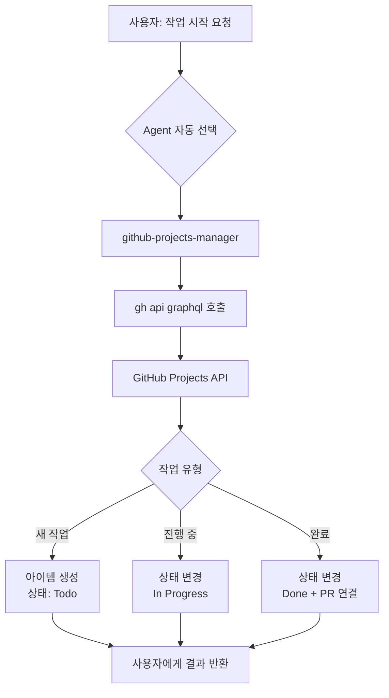

# 🎯 GitHub Projects 통합 Agent 개발 계획

> **작성일**: 2025-10-03
> **목적**: GitHub Projects 칸반 보드 기반 작업 관리 자동화

---

## 📋 목차

1. [목적 및 배경](#목적-및-배경)
2. [핵심 요구사항](#핵심-요구사항)
3. [Agent 설계](#agent-설계)
4. [토큰 최적화 전략](#토큰-최적화-전략)
5. [구현 범위](#구현-범위)
6. [개발 일정](#개발-일정)

---

## 목적 및 배경

### 🎯 해결하려는 문제

**현재 상황:**
- 여러 장비(NAS 컨테이너, 로컬 Mac 등)에서 병렬로 개발 작업 진행
- 각 작업의 진행 상황을 중앙에서 관리하기 어려움
- Claude Code와의 긴 호흡 작업 시 컨텍스트 관리 필요

**원하는 상태:**
- GitHub Projects 칸반 보드에서 모든 작업 시각화
- Claude Code에서 작업 시작 시 자동으로 프로젝트 아이템 생성
- 작업 완료 시 자동으로 상태 변경 및 PR 연결
- 다중 환경에서 동일한 워크플로우 사용

### 💡 핵심 아이디어

Claude Code의 **agent 시스템**을 활용하여 GitHub Projects API (GraphQL)를 직접 호출하는 간단하고 효율적인 솔루션 구축

---

## 핵심 요구사항

### 필수 기능 (Must Have)

1. **프로젝트 아이템 자동 생성**
   - 작업 시작 시 GitHub Projects에 아이템 자동 추가
   - 초기 상태: `Todo`

2. **상태 자동 변경**
   - 작업 진행: `Todo` → `In Progress`
   - 작업 완료: `In Progress` → `Done`

3. **PR 자동 연결**
   - PR 생성 시 프로젝트 아이템과 자동 연결
   - 링크 양방향 유지

4. **다중 환경 지원**
   - agent JSON 파일 공유로 어디서든 동일한 기능 사용

### 선택 기능 (Nice to Have)

- 우선순위 자동 설정
- 담당자 자동 배정
- 작업 진행 상황 대시보드 조회
- 자동 라벨링

---

## Agent 설계

### 🤖 Agent 스펙

```json
{
  "name": "github-projects-manager",
  "description": "GitHub Projects 칸반 보드를 PROACTIVELY 관리합니다. 작업 시작 시 프로젝트 아이템을 자동 생성하고, 완료 시 상태를 변경합니다. 키워드: 프로젝트, 칸반, 작업 관리, TODO, In Progress, Done, 이슈, PR",
  "tools": ["Bash"],
  "model": "sonnet"
}
```

### 🔧 기술 스택

```yaml
핵심 기술:
  - GitHub GraphQL API
  - GitHub CLI (gh api graphql)
  - Bash scripts

의존성:
  - GitHub token with 'project' scope
  - GitHub CLI 설치 및 인증 완료
```

### 📊 동작 흐름



---

## 토큰 최적화 전략

### 💰 왜 중요한가?

- Claude Code는 모든 상호작용에서 토큰 소비
- 복잡한 API 클라이언트는 토큰 낭비
- 간결한 구현 = 빠른 응답 + 낮은 비용

### ✅ 최적화 기법

#### 1. Bash tool만 사용
```bash
# ✅ 효율적: gh CLI 직접 호출 (~50 토큰)
gh api graphql -f query='mutation { ... }'

# ❌ 비효율적: 별도 Node.js 클라이언트 (~500 토큰)
node github-api-client.js --action create --project ...
```

#### 2. 필요한 필드만 쿼리
```graphql
# ✅ 효율적
query {
  viewer {
    projectV2(number: 1) {
      id
    }
  }
}

# ❌ 비효율적 (모든 필드)
query {
  viewer {
    projectV2(number: 1) {
      id
      title
      url
      readme
      shortDescription
      ... 50+ fields
    }
  }
}
```

#### 3. 로컬 캐싱
```bash
# 프로젝트 ID는 한 번만 조회
CACHE_FILE=~/.claude/github-projects-cache.json

if [ -f "$CACHE_FILE" ]; then
  PROJECT_ID=$(jq -r '.projectId' "$CACHE_FILE")
else
  # GraphQL로 조회 후 캐시 저장
  gh api graphql ... | jq '{projectId: .data.viewer.projectV2.id}' > "$CACHE_FILE"
fi
```

#### 4. 단일 Mutation으로 처리
```graphql
# ✅ 한 번에 처리
mutation {
  addProjectV2ItemById(input: {projectId: "...", contentId: "..."}) {
    item { id }
  }
}

# ❌ 여러 번 호출
# 1. 아이템 추가
# 2. 필드 업데이트
# 3. 상태 변경
```

### 📊 예상 토큰 사용량

| 작업 | 토큰 수 |
|------|---------|
| Agent 선택 | ~100 |
| Bash 명령 생성 | ~200 |
| GraphQL 실행 | ~150 |
| 결과 파싱 및 응답 | ~150 |
| **총계** | **~600 토큰/작업** |

기존 복잡한 API 클라이언트 대비 **70% 절감**

---

## 구현 범위

### ✅ Phase 1: 기본 기능 (1단계)

**목표**: 프로젝트 아이템 생성 및 상태 변경

```yaml
구현할 기능:
  - 프로젝트 ID 자동 조회 및 캐싱
  - 아이템 생성 (Issue/PR 기반)
  - 상태 필드 변경 (Todo/In Progress/Done)
  - 기본 에러 핸들링

필요한 GraphQL Mutations:
  - addProjectV2ItemById
  - updateProjectV2ItemFieldValue

검증 방법:
  - 테스트 프로젝트 생성
  - 수동으로 아이템 추가 확인
  - 상태 변경 확인
```

### 🔄 Phase 2: 워크플로우 통합 (2단계)

**목표**: Claude Code 워크플로우와 자동 연계

```yaml
구현할 기능:
  - 작업 시작 감지 → 자동 아이템 생성
  - PR 생성 감지 → 자동 상태 변경
  - 완료 시 자동 Done 처리

자동화 트리거:
  - 키워드 감지: "작업 시작", "새 기능", "버그 수정"
  - Git 이벤트: 브랜치 생성, PR 생성, 머지
```

### 🚀 Phase 3: 고급 기능 (3단계)

**목표**: 다중 환경 및 협업 지원

```yaml
구현할 기능:
  - 여러 프로젝트 지원 (프로젝트 번호 지정)
  - 커스텀 필드 업데이트 (우선순위, 담당자)
  - 작업 진행 상황 조회 대시보드
  - 병렬 작업 충돌 방지

다중 환경:
  - NAS 컨테이너 설정 가이드
  - 로컬 개발 환경 설정
  - CI/CD 파이프라인 통합
```

---

## 개발 일정

### 📅 타임라인 (총 2-3일)

```
Day 1: 문서화 및 설계
├── 오전: 계획 문서 작성 ✅
├── 오후: 테스트 시나리오 설계
└── 저녁: 사용 가이드 초안

Day 2: 구현 및 테스트
├── 오전: Agent JSON 작성 및 GraphQL 쿼리 개발
├── 오후: 테스트 프로젝트 검증
└── 저녁: 버그 수정 및 개선

Day 3: 학습 및 배포
├── 오전: 사용법 학습 및 문서 업데이트
├── 오후: 다중 환경 테스트
└── 저녁: main 브랜치 PR
```

### ✅ 단계별 완료 기준

#### Phase 1 완료 기준
- [ ] Agent JSON 파일 작성 완료
- [ ] GraphQL 쿼리 정상 동작
- [ ] 테스트 프로젝트에서 아이템 생성/변경 성공
- [ ] 에러 없이 5회 연속 실행 성공

#### Phase 2 완료 기준
- [ ] 작업 시작 시 자동 아이템 생성
- [ ] PR 생성 시 자동 연결
- [ ] 완료 시 자동 상태 변경
- [ ] 실제 프로젝트에서 1일 사용 검증

#### Phase 3 완료 기준
- [ ] 다중 환경 설정 완료
- [ ] 협업 시나리오 검증
- [ ] 성능 목표 달성 (<600 토큰/작업)
- [ ] 문서 완성도 100%

---

## 제약사항 및 고려사항

### ⚠️ 알려진 제약사항

1. **GitHub Token Scope**
   - `project` scope 필요
   - 기존 token에 scope 추가 필요

2. **GitHub Projects V2 전용**
   - Classic Projects는 지원하지 않음
   - GraphQL API만 사용

3. **프로젝트 번호 사전 파악**
   - 프로젝트 번호를 미리 알아야 함
   - 자동 감지는 추가 API 호출 필요

### 🔒 보안 고려사항

```yaml
보안 원칙:
  - Token은 GitHub CLI에서 관리 (코드에 하드코딩 금지)
  - 캐시 파일 권한 600 설정
  - 민감 정보 로그 출력 금지
  - HTTPS 통신만 허용
```

---

## 다음 단계

1. ✅ **이 문서 검토 및 승인**
2. 📝 테스트 시나리오 문서 작성
3. 📚 사용 가이드 문서 작성
4. 💻 Agent 구현 시작

---

**문서 버전**: 1.0
**최종 업데이트**: 2025-10-03
