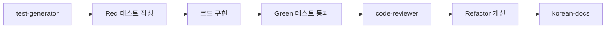

# 🤖 에이전트 활용 가이드

> TDD와 한국어 문서화에 특화된 4개 agents 상세 가이드

## 📋 목차

1. [에이전트 팩 구성](#에이전트-팩-구성)
2. [Core Pack 상세](#core-pack-상세)
3. [Advanced Pack 상세](#advanced-pack-상세)
4. [실전 활용 시나리오](#실전-활용-시나리오)
5. [팁과 베스트 프랙티스](#팁과-베스트-프랙티스)

---

## 에이전트 팩 구성

### 🎯 2단계 팩 시스템

| 팩 | 대상 | agents | 용도 |
|---|---|--------|------|
| 🚀 **Core Pack** | 모든 개발자 | 3개 | 코드 리뷰, TDD, 한국어 문서 |
| ⚡ **Advanced Pack** | 프로젝트 관리 필요 시 | +1개 | GitHub Projects 칸반 보드 |

### 💡 왜 4개만?

- ✅ **기존 agents와 충돌 최소화**: Claude Code 기본 제공 agents와 중복 제거
- ✅ **명확한 역할 분담**: 각 agent가 고유한 책임을 가짐
- ✅ **한국어 특화**: 한국어 문서와 리뷰에 최적화
- ✅ **TDD 중심**: 테스트 주도 개발 워크플로우 지원

---

## 🚀 Core Pack 상세

### 1. 🔍 code-reviewer

**목적**: 한국어로 친절한 코드 리뷰

**자동 선택 트리거**:
- "코드를 검토해주세요"
- "이 함수를 리뷰해주세요"
- "코드 개선점을 알려주세요"

**주요 기능**:
- 코드 가독성과 유지보수성 검토
- 베스트 프랙티스 준수 확인
- 함수/변수 명명 규칙 검토
- 중복 코드 탐지
- TDD 관점의 피드백

**출력 형식**:
```
## 🔍 코드 리뷰 결과

### Critical (반드시 수정)
- 에러 핸들링 누락
- 메모리 누수 가능성

### Important (빠른 개선 권장)
- 함수 길이 과다 (150줄)
- 변수명 불명확 (x, tmp)

### Nice to have (선택적)
- 주석 추가
- 타입 힌트 적용
```

**활용 예시**:
```javascript
function processUserData(data) {
    const result = [];
    for (let i = 0; i < data.length; i++) {
        result.push(data[i].toUpperCase());
    }
    return result;
}

// 요청: "이 함수를 검토해주세요"
// → code-reviewer가 가독성, 성능, 현대적 패턴 제안
```

---

### 2. 🧪 test-generator

**목적**: TDD 방식의 테스트 케이스 생성

**자동 선택 트리거**:
- "테스트를 작성해주세요"
- "TDD로 개발하고 싶어요"
- "테스트 케이스가 필요해요"

**주요 기능**:
- Red-Green-Refactor 사이클 지원
- 정상 케이스 (Happy path)
- 엣지 케이스 (Edge cases)
- 경계값 테스트 (Boundary tests)
- 에러 케이스 (Error handling)
- 한국어 주석 포함

**출력 형식**:
```javascript
describe('함수명', () => {
    // 🔴 Red: 실패하는 테스트부터
    it('정상 케이스 설명', () => {
        // Given (준비)
        const input = ...;

        // When (실행)
        const result = ...;

        // Then (검증)
        expect(result).toBe(...);
    });

    // 엣지 케이스
    it('빈 배열 처리', () => { ... });

    // 경계값
    it('최대값 입력', () => { ... });

    // 에러 케이스
    it('null 입력 시 에러', () => { ... });
});
```

**활용 예시**:
```javascript
// 요청: "사용자 등록 함수의 테스트를 작성해주세요"
// → test-generator가 TDD 테스트 케이스 생성

// 출력:
describe('registerUser', () => {
    it('유효한 사용자 정보로 등록에 성공해야 함', () => {
        const userData = { email: 'test@example.com', password: 'secure123' };
        const result = registerUser(userData);
        expect(result.success).toBe(true);
    });

    it('중복된 이메일로 등록 시 에러를 발생시켜야 함', () => {
        expect(() => registerUser({ email: 'existing@example.com' })).toThrow('이미 존재하는 이메일');
    });
});
```

---

### 3. 📚 korean-docs

**목적**: 체계적이고 상세한 한국어 기술 문서 작성

**자동 선택 트리거**:
- "문서를 작성해주세요"
- "README를 만들어주세요"
- "API 가이드가 필요해요"
- "한국어로 설명해주세요"

**주요 기능**:
- 📋 목차: 전체 내용을 한눈에
- 🎯 개요: 목적과 대상 독자
- 📝 본문: 단계별 가이드
- 💡 예시: 실제 사용 사례와 코드
- ✨ 베스트 프랙티스: 권장 사항
- ❓ FAQ: 자주 묻는 질문

**출력 형식**:
```markdown
# 📚 [제목]

## 📋 목차
1. [개요](#개요)
2. [사용법](#사용법)
3. [예시](#예시)

## 🎯 개요
이 문서는...

## 📝 사용법
### 1단계: 설치
```bash
npm install ...
```

### 2단계: 설정
...

## 💡 예시
실제 사용 예시...

## ✨ 베스트 프랙티스
- 권장 사항 1
- 주의 사항 2
```

**활용 예시**:
```javascript
// 요청: "이 UserService 클래스의 사용 가이드를 작성해주세요"

class UserService {
    async createUser(userData) { ... }
    async updateUser(id, updates) { ... }
    async deleteUser(id) { ... }
}

// → korean-docs가 체계적인 한국어 API 문서 생성
```

---

## ⚡ Advanced Pack 상세

### 4. 📋 github-projects-manager

**목적**: GitHub Projects 칸반 보드 자동 관리

**자동 선택 트리거** (PROACTIVE):
- "프로젝트", "Projects"
- "칸반", "보드"
- "TODO", "In Progress", "Done"
- "진행", "완료", "시작"

**주요 기능**:
1. **프로젝트 생성**
   - 새 GitHub Projects 보드 생성
   - Todo, In Progress, Done 컬럼 자동 설정

2. **작업 아이템 관리**
   - Issue/PR을 프로젝트에 추가
   - 작업 상태 자동 변경
   - 우선순위 및 레이블 관리

3. **상태 전환**
   - Todo → In Progress: 작업 시작
   - In Progress → Done: 작업 완료

**필수 조건**:
- GitHub CLI (`gh`) 설치
- Personal Access Token 설정

**활용 예시**:
```text
# 1. 프로젝트 생성
"AI 챗봇 개발 프로젝트를 생성해줘"
→ 새 GitHub Projects 보드 생성
→ URL: https://github.com/users/username/projects/1

# 2. 작업 추가
"Issue #42를 프로젝트에 추가하고 In Progress로 변경해줘"
→ Issue를 프로젝트에 추가
→ 상태를 In Progress로 설정

# 3. 작업 완료
"Issue #42를 Done으로 변경해줘"
→ 상태를 Done으로 변경
→ 완료 시간 기록
```

**상세 가이드**: [GitHub Projects Manager 가이드](./github-projects-manager-guide.md)

---

## 🎯 실전 활용 시나리오

### 시나리오 1: TDD로 새 기능 개발 (Core Pack)

```text
🎯 목표: 사용자 로그인 기능 TDD 개발

1. "사용자 로그인 기능의 테스트를 먼저 작성해주세요"
   → test-generator가 Red 테스트 생성

2. 테스트가 실패하는 것을 확인 (Red)

3. 테스트를 통과하도록 로그인 함수 구현 (Green)

4. "구현한 로그인 함수를 검토해주세요"
   → code-reviewer가 코드 품질 검토

5. 피드백 반영하여 리팩토링 (Refactor)

6. "로그인 기능 사용 가이드를 작성해주세요"
   → korean-docs가 API 문서 생성
```

### 시나리오 2: 개인 프로젝트 문서화 (Core Pack)

```text
🎯 목표: 개인 블로그 프로젝트 문서화

1. "블로그 프로젝트의 README를 작성해주세요"
   → korean-docs가 프로젝트 개요, 설치, 사용법 문서 생성

2. "댓글 기능의 테스트를 작성해주세요"
   → test-generator가 TDD 테스트 생성

3. "댓글 컴포넌트를 검토해주세요"
   → code-reviewer가 React 컴포넌트 리뷰

4. "API 엔드포인트 문서를 작성해주세요"
   → korean-docs가 API 레퍼런스 생성
```

### 시나리오 3: 프로젝트 관리 + 개발 (Core + Advanced)

```text
🎯 목표: GitHub Projects로 관리하며 개발

1. "블로그 프로젝트를 GitHub Projects로 생성해줘"
   → github-projects-manager가 칸반 보드 생성

2. "Issue #10 (댓글 기능)을 In Progress로 변경해줘"
   → 작업 시작 표시

3. "댓글 기능의 TDD 테스트를 작성해주세요"
   → test-generator가 테스트 생성

4. TDD로 댓글 기능 구현

5. "댓글 기능을 검토해주세요"
   → code-reviewer가 리뷰

6. "댓글 기능 사용 가이드를 작성해주세요"
   → korean-docs가 문서 생성

7. "Issue #10을 Done으로 변경해줘"
   → 작업 완료 표시
```

---

## 💡 팁과 베스트 프랙티스

### 1. 효과적인 요청 방법

#### ❌ 나쁜 예시
```text
"코드를 확인해주세요"
"테스트를 작성해주세요"
"문서를 만들어주세요"
```

#### ✅ 좋은 예시
```text
"이 사용자 인증 함수의 가독성과 보안을 검토해주세요"
"결제 처리 함수의 TDD 테스트를 작성해주세요. 엣지 케이스와 에러 핸들링을 포함해서요"
"React 컴포넌트 라이브러리의 설치부터 예시까지 포함한 한국어 가이드를 작성해주세요"
```

### 2. TDD 워크플로우

**권장 순서**:


**실제 적용**:
1. **Red**: test-generator로 실패하는 테스트 작성
2. **Green**: 테스트를 통과하는 최소한의 코드 구현
3. **Refactor**: code-reviewer로 코드 품질 개선
4. **Document**: korean-docs로 사용 가이드 작성

### 3. 에이전트 자동 선택 최적화

**자동 선택되도록 키워드 사용**:
- code-reviewer: "검토", "리뷰", "코드 확인"
- test-generator: "테스트", "TDD", "테스트 케이스"
- korean-docs: "문서", "가이드", "README", "한국어"
- github-projects-manager: "프로젝트", "칸반", "TODO", "진행"

**명시적 호출**:
```text
"molidae-core:code-reviewer 에이전트로 이 함수를 검토해주세요"
"molidae-core:test-generator 에이전트로 TDD 테스트를 작성해주세요"
```

### 4. 팩별 추천 워크플로우

#### 🚀 Core Pack만 사용 (3개)
```text
문서화 → TDD 개발 → 코드 리뷰 → 배포
    ↓         ↓          ↓
korean-docs  test      code-
             generator  reviewer
```

#### ⚡ Advanced Pack 추가 (4개)
```text
프로젝트 생성 → 작업 시작 → TDD 개발 → 리뷰 → 문서화 → 작업 완료
      ↓            ↓          ↓         ↓        ↓          ↓
github-      github-      test-     code-    korean-   github-
projects     projects     generator reviewer  docs     projects
manager      manager                                   manager
```

### 5. 효율적인 개발 패턴

**패턴 1: 문서 우선 개발**
```text
1. korean-docs로 API 스펙 문서 작성
2. test-generator로 스펙에 맞는 테스트 생성
3. 테스트를 통과하도록 구현
4. code-reviewer로 최종 검토
```

**패턴 2: 테스트 우선 개발 (순수 TDD)**
```text
1. test-generator로 실패하는 테스트 작성
2. 최소한의 코드로 테스트 통과
3. code-reviewer로 리팩토링 가이드 받기
4. korean-docs로 완성된 기능 문서화
```

**패턴 3: 프로젝트 관리형 개발**
```text
1. github-projects-manager로 프로젝트/작업 생성
2. 작업 시작 시 상태를 In Progress로 변경
3. TDD 워크플로우 진행 (test → code → review → docs)
4. 작업 완료 시 Done으로 변경
```

---

## 🎉 핵심 정리

### 각 Agent의 핵심 가치

| Agent | 핵심 가치 | 언제 사용? |
|-------|----------|-----------|
| 🔍 **molidae-core:code-reviewer** | 코드 품질 향상 | 구현 후 검토 필요 시 |
| 🧪 **molidae-core:test-generator** | TDD 개발 지원 | 기능 구현 전 테스트 작성 시 |
| 📚 **molidae-core:korean-docs** | 체계적 문서화 | README, API 가이드 작성 시 |
| 📋 **molidae-advanced:github-projects-manager** | 프로젝트 관리 | 칸반 보드로 작업 추적 시 |

### 시작하는 방법

1. **Core Pack (3개)부터 시작**
   ```bash
   ln -sf ~/IdeaProjects/molidae/ai/agents/core/*.md ~/.claude/agents/
   ```

2. **TDD 워크플로우 익히기**
   - test-generator → 구현 → code-reviewer

3. **필요 시 Advanced Pack 추가**
   ```bash
   ln -sf ~/IdeaProjects/molidae/ai/agents/advanced/*.md ~/.claude/agents/
   ```

### 🚀 다음 단계

- [agents/README.md](../agents/README.md): 전체 에이전트 개요 및 설치 가이드
- [GitHub Projects Manager 가이드](./github-projects-manager-guide.md): 칸반 보드 상세 사용법

---

*4개의 간결한 agents로 효율적인 개발을 시작하세요!* 🚀
