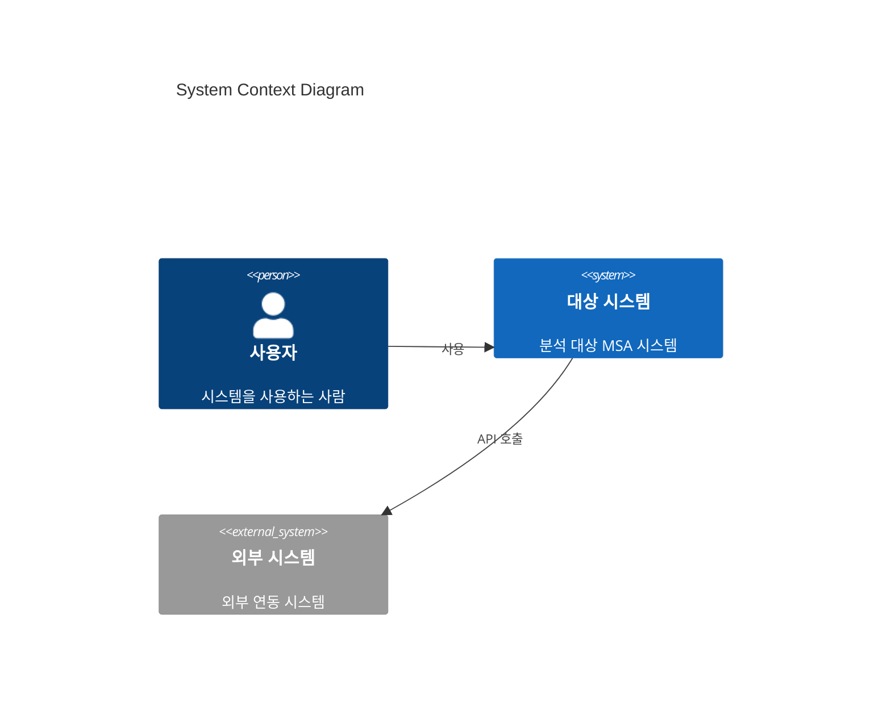
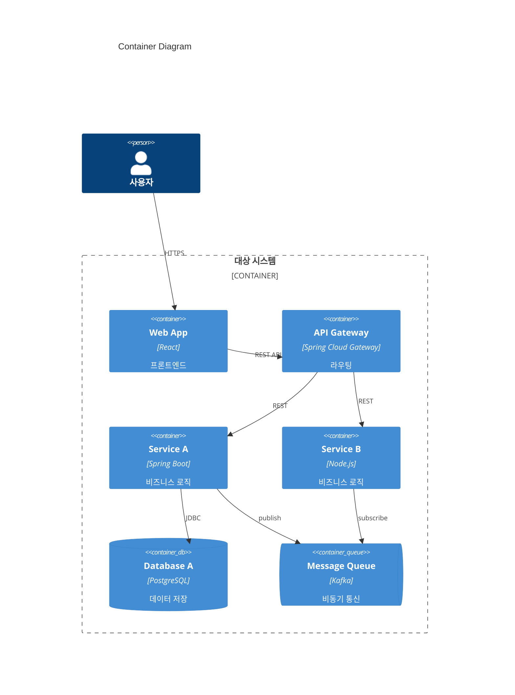
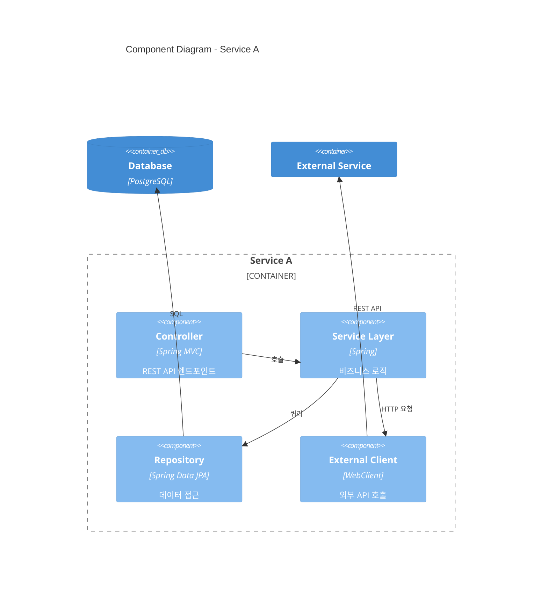

# C4 모델 + Mermaid 문법 참조

## C4 모델 개요

C4 모델은 소프트웨어 아키텍처를 4개 레벨로 시각화합니다:

| 레벨 | 이름 | 대상 청중 | 설명 |
|------|------|-----------|------|
| 1 | System Context | 모든 사람 | 시스템과 외부 시스템/사용자의 관계 |
| 2 | Container | 기술 팀 | 서비스, DB, MQ 등 배포 단위 |
| 3 | Component | 개발자 | 주요 서비스의 내부 컴포넌트 |
| 4 | Code | 개발자 | 클래스/모듈 수준 (이 플러그인에서는 미사용) |

## Mermaid C4 문법

### Level 1: System Context

### Level 2: Container

### Level 3: Component

## C4 요소 타입 정리

| 요소 | Mermaid 문법 | 용도 |
|------|-------------|------|
| 사람 | `Person(alias, "이름", "설명")` | 사용자, 관리자 |
| 시스템 | `System(alias, "이름", "설명")` | 분석 대상 시스템 |
| 외부 시스템 | `System_Ext(alias, "이름", "설명")` | 외부 연동 |
| 컨테이너 | `Container(alias, "이름", "기술", "설명")` | 서비스, 앱 |
| DB | `ContainerDb(alias, "이름", "기술", "설명")` | 데이터베이스 |
| 큐 | `ContainerQueue(alias, "이름", "기술", "설명")` | 메시지 큐 |
| 컴포넌트 | `Component(alias, "이름", "기술", "설명")` | 내부 모듈 |
| 경계 | `Container_Boundary(alias, "이름")` | 그룹핑 |
| 관계 | `Rel(from, to, "라벨")` | 의존성 표현 |

## 관계(Rel) 표현 가이드

| 유형 | 라벨 예시 |
|------|-----------|
| REST API | `"REST/HTTP"`, `"GET /api/users"` |
| gRPC | `"gRPC"` |
| 메시지 | `"publish/subscribe"`, `"Kafka: topic-name"` |
| DB 접근 | `"JDBC"`, `"SQL"`, `"MongoDB Driver"` |
| 파일 | `"S3"`, `"NFS"` |

## 주의사항

1. alias는 영문 소문자 + 숫자만 사용 (하이픈, 공백 불가)
2. 이름과 설명은 한글 사용 가능
3. Mermaid C4 다이어그램은 Obsidian 1.4+에서 네이티브 렌더링
4. GitHub에서도 Mermaid C4 지원
5. 다이어그램이 복잡할 경우 서비스 그룹별로 분리
