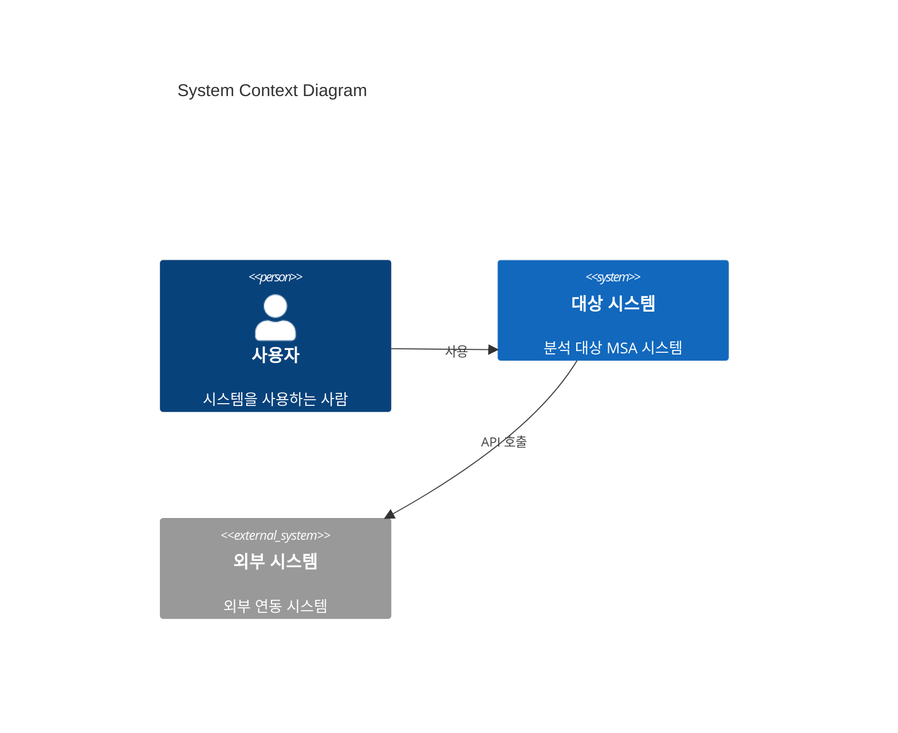
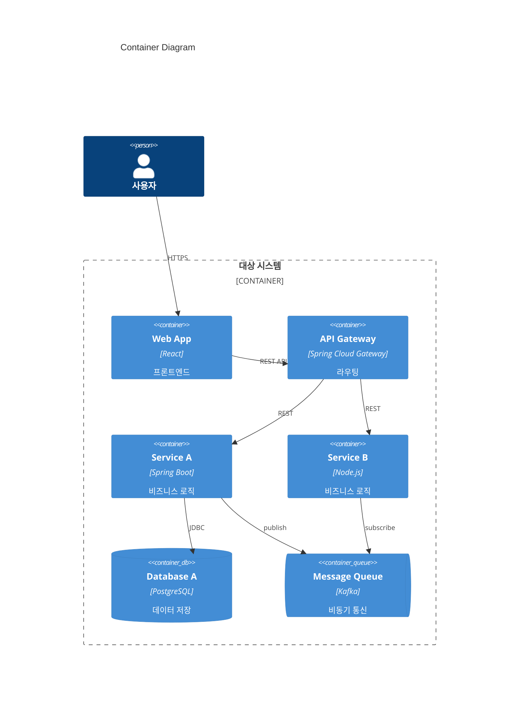
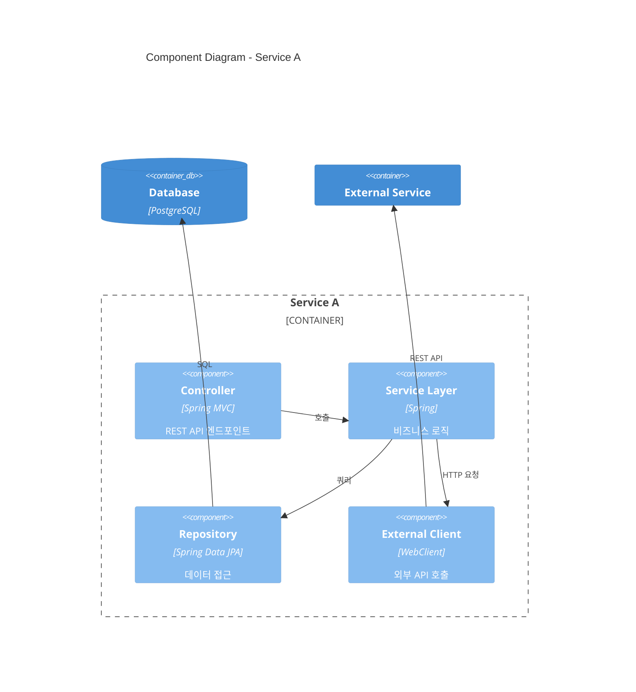

# C4 Model + Mermaid Syntax Reference

## C4 Model Overview

Visualizes software architecture at 4 levels:

| Level | Name | Audience | Description |
|-------|------|----------|-------------|
| 1 | System Context | Everyone | System and external systems/users relationships |
| 2 | Container | Technical team | Services, DBs, MQs — deployment units |
| 3 | Component | Developers | Internal components of key services |
| 4 | Code | Developers | Class/module level (unused in this plugin) |

## Mermaid C4 Syntax

### Level 1: System Context

### Level 2: Container

### Level 3: Component

## C4 Element Types

| Element | Mermaid Syntax | Usage |
|---------|---------------|-------|
| Person | `Person(alias, "name", "desc")` | Users, admins |
| System | `System(alias, "name", "desc")` | Target system |
| External System | `System_Ext(alias, "name", "desc")` | External integration |
| Container | `Container(alias, "name", "tech", "desc")` | Services, apps |
| DB | `ContainerDb(alias, "name", "tech", "desc")` | Databases |
| Queue | `ContainerQueue(alias, "name", "tech", "desc")` | Message queues |
| Component | `Component(alias, "name", "tech", "desc")` | Internal modules |
| Boundary | `Container_Boundary(alias, "name")` | Grouping |
| Relationship | `Rel(from, to, "label")` | Dependencies |

## Relationship (Rel) Label Guide

| Type | Label Examples |
|------|---------------|
| REST API | `"REST/HTTP"`, `"GET /api/users"` |
| gRPC | `"gRPC"` |
| Message | `"publish/subscribe"`, `"Kafka: topic-name"` |
| DB access | `"JDBC"`, `"SQL"`, `"MongoDB Driver"` |
| File | `"S3"`, `"NFS"` |

## Rules

1. alias: lowercase + digits only (no hyphens, spaces)
2. Names and descriptions may use Korean
3. Mermaid C4 diagrams render natively in Obsidian 1.4+
4. GitHub also supports Mermaid C4
5. Split complex diagrams by service group
