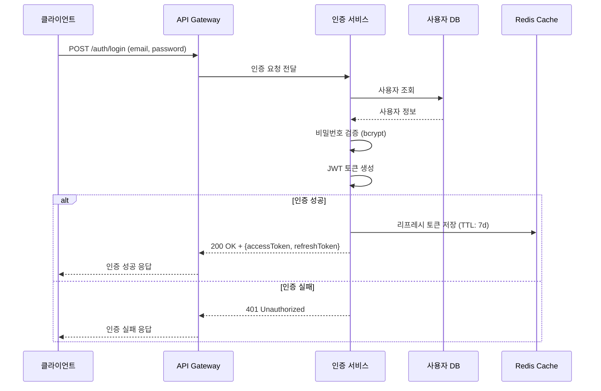
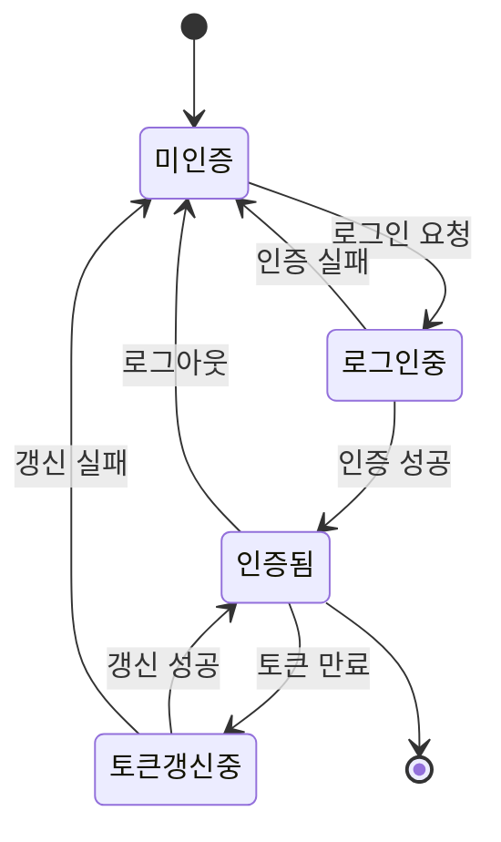

# Tech Spec 작성 패턴 예시

이 스킬은 Tech Spec 작성 시 자주 발생하는 좋은 패턴과 나쁜 패턴을 예시로 제공한다.

---

## 1. Goals & Non-Goals

### 나쁜 예

```markdown
### Goals
1. 좋은 사용자 경험 제공
2. 시스템 성능 개선
```

**문제점**:
- "좋은", "개선" 등 모호한 형용사 사용
- 측정 불가능한 목표
- Goals가 2개뿐 (최소 3개 필요)

### 좋은 예

```markdown
### Goals
1. 사용자 로그인 시 JWT 기반 인증을 도입하여 세션 관리 비용을 제거한다
2. 로그인 API 응답시간을 p99 기준 200ms 이내로 유지한다
3. 소셜 로그인(Google, Apple) 연동으로 회원가입 전환율을 30% 향상한다

### Non-Goals
1. 기존 세션 기반 인증을 즉시 제거하지 않는다 (점진적 마이그레이션)
2. 생체 인증(Face ID, 지문)은 이번 범위에 포함하지 않는다
```

**포인트**:
- 구체적이고 측정 가능한 목표
- 기술적 결정과 기대 효과를 명시
- Non-Goals로 범위를 명확히 제한

---

## 2. NFR 구체화 패턴

### 나쁜 예 → 좋은 예 변환

| 나쁜 예 | 좋은 예 |
|---------|---------|
| 높은 가용성 | 99.9% 가용성 (연간 다운타임 8.76시간 이내) |
| 빠른 응답시간 | p95 응답시간 100ms 이내, p99 200ms 이내 |
| 대량 처리 가능 | 초당 10,000건 이상 이벤트 처리 (피크 시 50,000건) |
| 안전한 데이터 저장 | AES-256 암호화, 전송 시 TLS 1.3 적용 |
| 쉬운 확장 | 수평 확장 시 노드당 처리량 선형 증가 (최대 10노드) |
| 적절한 로깅 | ERROR 이상 로그 100% 수집, 보관 기간 90일 |

### NFR 작성 템플릿

```markdown
| ID | 카테고리 | 요구사항 | 목표 수치 |
|----|---------|---------|----------|
| NFR-001 | 성능 | API 응답시간 | p95 < 100ms, p99 < 200ms |
| NFR-002 | 가용성 | 서비스 가용률 | 99.9% (월간 다운타임 43분 이내) |
| NFR-003 | 처리량 | 동시 접속자 수 | 10,000명 (피크 시 30,000명) |
| NFR-004 | 보안 | 데이터 암호화 | 저장: AES-256, 전송: TLS 1.3 |
| NFR-005 | 확장성 | 수평 확장 | 노드 추가 시 처리량 선형 증가 |
```

---

## 3. 리스크 매트릭스 작성 예시

### 나쁜 예

```markdown
## 리스크
- 일정이 지연될 수 있다
- 기술적 문제가 발생할 수 있다
```

**문제점**:
- 유형 구분 없음
- 확률/영향도 평가 없음
- 완화 전략 없음

### 좋은 예

```markdown
## 7. 리스크 & 완화 전략

| ID | 리스크 | 유형 | 확률 | 영향도 | 완화 전략 |
|----|--------|------|------|--------|----------|
| R-001 | Redis Cluster 장애 시 인증 토큰 검증 불가 | 기술 | 하 | 상 | 로컬 캐시 폴백 (TTL 5분) + Circuit Breaker 패턴 적용 |
| R-002 | OAuth 제공자(Google) API 변경으로 소셜 로그인 중단 | 외부 | 중 | 상 | Provider Adapter 패턴으로 격리, API 버전 고정 + 변경 모니터링 알림 |
| R-003 | JWT 시크릿 키 유출 시 전체 토큰 무효화 필요 | 기술 | 하 | 상 | 키 로테이션 자동화 (분기별), Key ID(kid) 기반 다중 키 지원 |
| R-004 | 마이그레이션 기간 중 세션/JWT 이중 인증 부하 증가 | 일정 | 상 | 중 | 단계적 마이그레이션 (서비스별 순차 전환), 부하 테스트 선행 |
| R-005 | Apple 로그인 Private Email Relay로 사용자 식별 불가 | 외부 | 중 | 중 | 내부 사용자 ID 기반 매핑, email 의존 로직 제거 |
```

### 리스크 유형 분류 기준

- **기술**: 기술 선택, 구현 난이도, 성능, 장애 관련
- **일정**: 리소스 부족, 일정 지연, 의존성 지연 관련
- **외부**: 외부 서비스, 규제 변경, 시장 변화 관련

---

## 4. Mermaid 다이어그램 패턴

### 시퀀스 다이어그램



### 아키텍처 다이어그램


### 상태 다이어그램



---

## 5. 대안 검토 작성 패턴

### 나쁜 예

```markdown
## 대안 검토
JWT를 선택했다. 세션 방식보다 좋기 때문이다.
```

### 좋은 예

```markdown
## 9. 대안 검토

### 9.1 검토한 대안

#### 대안 A: 세션 기반 인증 (현행 유지)
- **설명**: 서버 측 세션 스토어에 인증 상태 저장
- **장점**: 구현 단순, 즉시 무효화 가능, 기존 코드 재사용
- **단점**: 수평 확장 시 세션 동기화 필요 (Sticky Session 또는 Redis), 서버 상태 관리 부담

#### 대안 B: JWT + Refresh Token (선택)
- **설명**: Stateless 토큰 기반 인증, 리프레시 토큰으로 갱신
- **장점**: 수평 확장 용이, 서버 상태 무관, 마이크로서비스 간 전파 용이
- **단점**: 토큰 즉시 무효화 어려움 (블랙리스트 필요), 토큰 크기

#### 대안 C: OAuth 2.0 + OIDC 위임 (외부 IdP)
- **설명**: Auth0, Cognito 등 외부 IdP에 인증 위임
- **장점**: 구현 최소화, 보안 책임 분산, 다양한 인증 방식 지원
- **단점**: 외부 서비스 의존, 비용 증가, 커스터마이징 제한

### 9.2 선택 근거
대안 B를 선택한다. 이유:
1. 현재 아키텍처가 마이크로서비스로 전환 중이며, stateless 인증이 서비스 간 토큰 전파에 유리하다
2. 리프레시 토큰을 Redis에 저장하여 즉시 무효화 문제를 해결할 수 있다
3. 외부 IdP 대비 비용 절감 및 커스터마이징 자유도가 높다
```

---

## 6. 수용 기준 작성 패턴 (Given/When/Then)

### 나쁜 예

```markdown
| FR-001 | 로그인 기능 | 로그인이 되어야 함 | P0 |
```

### 좋은 예

```markdown
| FR-001 | 이메일/비밀번호 로그인 | Given: 가입된 사용자, When: 올바른 이메일+비밀번호로 POST /auth/login, Then: 200 OK + JWT 토큰 반환 (accessToken 만료: 1h, refreshToken 만료: 7d) | P0 |
| FR-002 | 로그인 실패 처리 | Given: 가입된 사용자, When: 잘못된 비밀번호로 5회 시도, Then: 계정 잠금 (30분) + 429 응답 + 잠금 해제 시각 포함 | P0 |
```
