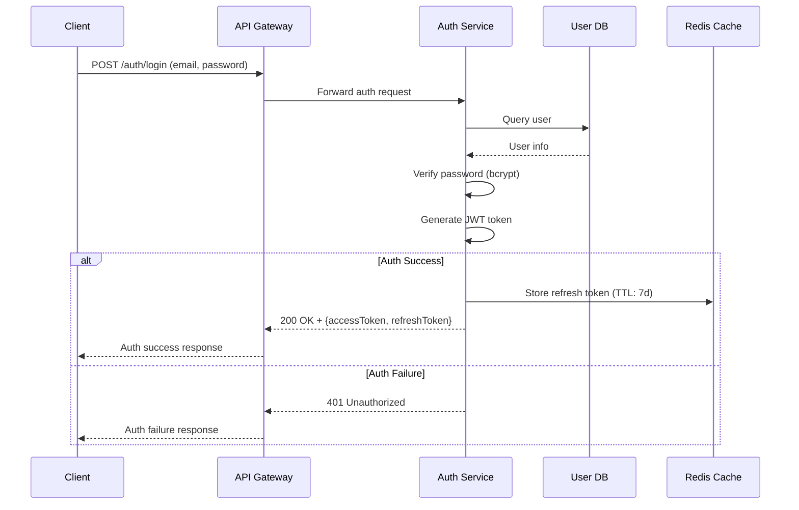
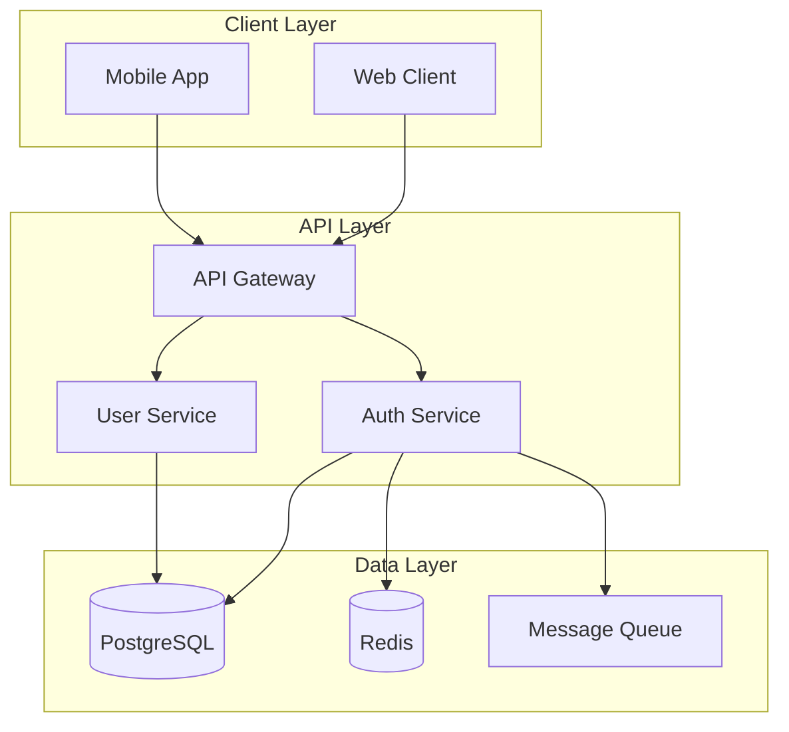
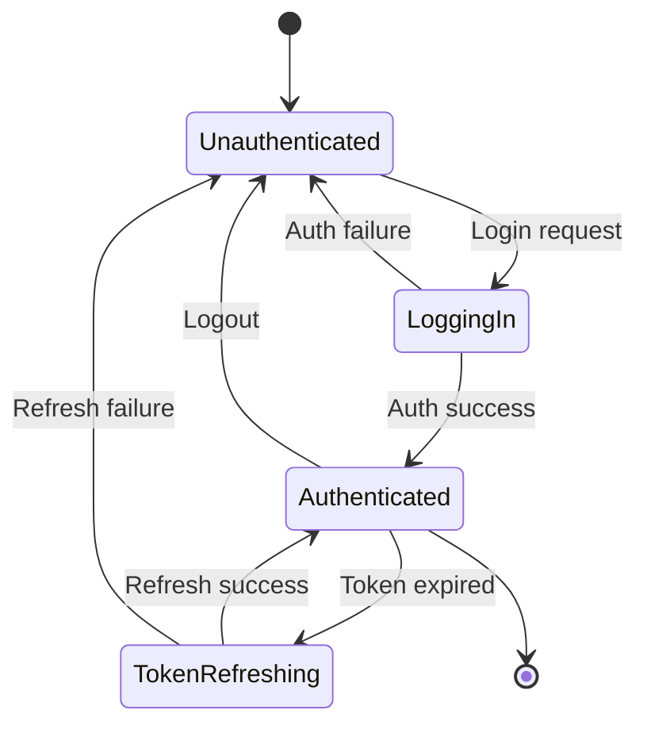

# Tech Spec Writing Pattern Examples

Reference examples of common good and bad patterns in Tech Spec writing.

## 1. Goals & Non-Goals

### Bad Example

```markdown
### Goals
1. Provide good user experience
2. Improve system performance
```

**Problems**: Vague adjectives ("good", "improve"), unmeasurable goals, only 2 Goals (minimum 3 required).

### Good Example

```markdown
### Goals
1. Introduce JWT-based auth on user login to eliminate session management cost
2. Maintain login API response time under 200ms at p99
3. Increase signup conversion rate by 30% via social login (Google, Apple) integration

### Non-Goals
1. Do not immediately remove existing session-based auth (gradual migration)
2. Biometric auth (Face ID, fingerprint) is out of scope
```

**Key points**: Specific and measurable goals, technical decisions with expected effects stated, scope clearly bounded by Non-Goals.

## 2. NFR Concretization Patterns

### Bad > Good Conversion

| Bad | Good |
|---------|---------|
| High availability | 99.9% availability (annual downtime <= 8.76 hours) |
| Fast response time | p95 response time <= 100ms, p99 <= 200ms |
| Handle large volume | >= 10,000 events/sec (peak 50,000) |
| Secure data storage | AES-256 encryption at rest, TLS 1.3 in transit |
| Easy scaling | Linear throughput increase per node on horizontal scale (max 10 nodes) |
| Appropriate logging | 100% collection of ERROR+ logs, 90-day retention |

### NFR Writing Template

```markdown
| ID | Category | Requirement | Target Metric |
|----|---------|---------|----------|
| NFR-001 | Performance | API response time | p95 < 100ms, p99 < 200ms |
| NFR-002 | Availability | Service uptime | 99.9% (monthly downtime <= 43 min) |
| NFR-003 | Throughput | Concurrent users | 10,000 (peak 30,000) |
| NFR-004 | Security | Data encryption | At rest: AES-256, In transit: TLS 1.3 |
| NFR-005 | Scalability | Horizontal scaling | Linear throughput increase on node addition |
```

## 3. Risk Matrix Example

### Bad Example

```markdown
## Risks
- Schedule may be delayed
- Technical issues may occur
```

**Problems**: No type classification, no probability/impact assessment, no mitigation strategy.

### Good Example

```markdown
## 7. Risks & Mitigation

| ID | Risk | Type | Probability | Impact | Mitigation |
|----|--------|------|------|--------|----------|
| R-001 | Redis Cluster failure makes auth token verification impossible | Technical | L | H | Local cache fallback (TTL 5min) + Circuit Breaker pattern |
| R-002 | OAuth provider (Google) API change breaks social login | External | M | H | Provider Adapter pattern for isolation, pin API version + change monitoring alerts |
| R-003 | JWT secret key leak requires full token invalidation | Technical | L | H | Automated key rotation (quarterly), Key ID (kid) based multi-key support |
| R-004 | Dual session/JWT auth load increase during migration | Schedule | H | M | Phased migration (sequential per-service rollout), load testing first |
| R-005 | Apple Login Private Email Relay makes user identification impossible | External | M | M | Internal user ID-based mapping, remove email-dependent logic |
```

### Risk Type Classification

- **Technical**: Technology choices, implementation difficulty, performance, failures
- **Schedule**: Resource shortage, schedule delays, dependency delays
- **External**: External services, regulatory changes, market changes

## 4. Mermaid Diagram Patterns

### Sequence Diagram



### Architecture Diagram



### State Diagram



## 5. Alternative Review Patterns

### Bad Example

```markdown
## Alternative Review
Chose JWT. Because it's better than sessions.
```

### Good Example

```markdown
## 9. Alternative Review

### 9.1 Reviewed Alternatives

#### Alternative A: Session-based Auth (maintain current)
- **Description**: Store auth state in server-side session store
- **Pros**: Simple implementation, instant invalidation, reuse existing code
- **Cons**: Session sync needed on horizontal scale (Sticky Session or Redis), server state management burden

#### Alternative B: JWT + Refresh Token (selected)
- **Description**: Stateless token-based auth, renewal via refresh token
- **Pros**: Easy horizontal scaling, server-state independent, easy propagation across microservices
- **Cons**: Difficult instant token invalidation (blacklist needed), token size

#### Alternative C: OAuth 2.0 + OIDC Delegation (external IdP)
- **Description**: Delegate auth to external IdP like Auth0, Cognito
- **Pros**: Minimal implementation, distributed security responsibility, diverse auth method support
- **Cons**: External service dependency, cost increase, customization limitations

### 9.2 Selection Rationale
Select Alternative B because:
1. Current architecture is transitioning to microservices; stateless auth is advantageous for inter-service token propagation
2. Storing refresh tokens in Redis solves the instant invalidation problem
3. Lower cost and higher customization freedom compared to external IdP
```

## 6. Acceptance Criteria Patterns (Given/When/Then)

### Bad Example

```markdown
| FR-001 | Login feature | Login should work | P0 |
```

### Good Example

```markdown
| FR-001 | Email/password login | Given: Registered user, When: POST /auth/login with correct email+password, Then: 200 OK + JWT token returned (accessToken expiry: 1h, refreshToken expiry: 7d) | P0 |
| FR-002 | Login failure handling | Given: Registered user, When: 5 attempts with wrong password, Then: Account locked (30min) + 429 response + unlock time included | P0 |
```
